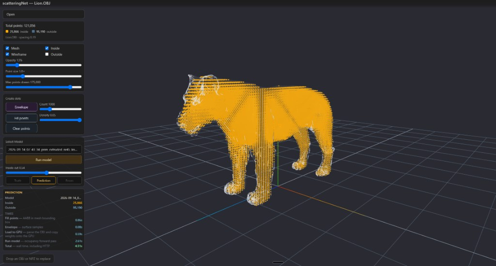
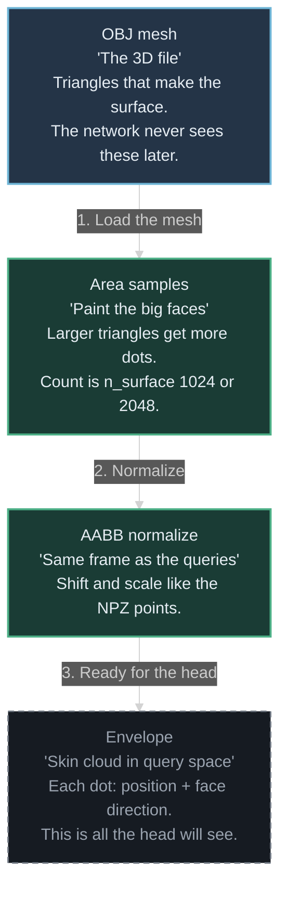

# scatteringNet — Occupancy Fill

## TL;DR

- PyTorch occupancy network that labels 3D query points **inside** a mesh volume (not on the surface, not outside).
- Input is an OBJ (or a labeled occupancy NPZ). Output is an inside / outside point cloud. How you display it is up to the host tool.
- **INSPECT** Fill (the one alias both UIs default to): envelope of **2048** skin dots and **24** nearest neighbors (`2026-09-14_07-43-34_prim_extruded_nr45_knn24_n2048_n6`). Pointer: [`docs/inspect_checkpoint.yaml`](docs/inspect_checkpoint.yaml). Area-only `09-16` and `pos_weight` are documented A/B logs, not this alias.
- Trained on CAD primitives and extrudes only. The frozen inspect OBJ list ([`docs/locked_holdout_objs.yaml`](docs/locked_holdout_objs.yaml)) must never enter `npz_catalog`.
- This is **not** how you should fill a volume in production. There are plenty of tools and libraries that do this quickly and accurately. This repo exists because I had already built that plugin, and I wanted to see the same job done with a network.

---

## Video Showcase

<a href="https://www.youtube.com/watch?v=vU45O0Mu0o4">
  
</a>
<p align="center"><strong>Occupancy fill with a neural net</strong></p>

**Gradio demo:** [huggingface.co/spaces/guyPerry/scatteringnet](https://huggingface.co/spaces/guyPerry/scatteringnet) — upload an OBJ (or pick a sample) and **Run model**. How to run it locally: [`src/gradio/README.md`](src/gradio/README.md).

---

## Image Gallery

Fill stills below are the **INSPECT** checkpoint (`knn_k: 24`, `n_surface: 2048`, mix-75: `2026-09-14_07-43-34_prim_extruded_nr45_knn24_n2048_n6`).  
Area-only `09-16` and `pos_weight` are A/B logs only. **None of the human / animal / combo stills were in the training catalog.** Gear is in-catalog. Helix is a catalog *family*, but not these bent / FFD meshes. Extrudes are a catalog family (`nr4` / `nr5`). The inspect OBJ names are locked in [`docs/locked_holdout_objs.yaml`](docs/locked_holdout_objs.yaml).


|                                                                             |                                                                                                  |                                                                                             |
| --------------------------------------------------------------------------- | ------------------------------------------------------------------------------------------------ | ------------------------------------------------------------------------------------------- |
|  **Woman (not in catalog)** |  **Man (not in catalog)**                          |  **Dog (not in catalog)**                     |
|  **Horse (not in catalog)** |  **Stylized human (not in catalog)**    |  **Combo animals (not in catalog)** |
|  **Gear (in catalog)**       |  **Helix (family in catalog; this mesh is not)** |  **Extrude (catalog family)**             |


Earlier n6 Fill (same catalog, `knn_k: 16`, `n_surface: 1024`) already transferred to organics. That was the jump from empty humans to a usable volume. The 2048 / k=24 run is a tighter OOD fill on top of that, not a new architecture.


|                                                                          |                                                                       |                                                                       |
| ------------------------------------------------------------------------ | --------------------------------------------------------------------- | --------------------------------------------------------------------- |
|  **n6 human (1080, k=16 / 1024)** |  **n6 horse (not in catalog)** |  **n6 shark (not in catalog)** |


---

## Project Inspiration

I already knew this was a bad production idea.

Filling a mesh with points is a geometry problem. A ray test, or the first-and-last-hit trick in **[scatteringNode](https://github.com/PerryGu/scatteringNode)** (a Maya C++ plugin I wrote, almost a decade ago), does it **accurately** and **faster** than a network ever will. A model is the wrong tool here: you spend hours of GPU time to approximate a test that the CPU already owns.

I built scatteringNet anyway. scatteringNode came first: ordinary programming on a **production job**. After the AI wave I wanted to close the loop — same task, this time as a network — out of curiosity, and to mark the shift from writing algorithms by hand to training them.

The result is the point of the repo, not a product pitch. **Use a neural net when the hand-written version is ugly or impossible. If the math already works, keep the math.** Volume fill is in the second bucket. This codebase is what it looks like to walk through the first bucket on purpose.

scatteringNet still asks a real research question on top of that: given only a skin sampling and a query point, can a network decide inside vs outside on shapes that were never in the training folder — thin extrudes, then (as a transfer test) humans and animals. The Maya plugin remains the production tool. This is the occupancy experiment next to it.

---

## Overview

scatteringNet is a learned volume-fill pipeline. Maya (or any DCC) still owns the mesh. This repo owns everything after that: occupancy NPZs, catalog training, checkpoints, and a Three.js viewer that fills an unlabeled lattice and runs the network.

The network does **not** emit points the way a particle system does. A regular grid (or a stored NPZ cloud) is placed in the mesh bounding box. Each point is classified: inside the solid or outside.

The stills below are that first step only: query points fill the box. They are not occupancy labels yet.


|                                                                                          |                                                                                              |                                                                                              |
| ---------------------------------------------------------------------------------------- | -------------------------------------------------------------------------------------------- | -------------------------------------------------------------------------------------------- |
|  **Query lattice in the bounding box (dog)** |  **Query lattice in the bounding box (human)** |  **Query lattice in the bounding box (torus)** |


The mesh is also reduced to an **envelope**: `n_surface` area-weighted samples on the skin (larger faces get more dots). Each sample stores position and a face normal. Early trains used **1024** (the stills below). The best OOD Fill later used **2048**. A query does not see the triangles. It sees this cloud: a global PointNet over all envelope dots, plus the `knn_k` nearest neighbors.


|                                                                                      |                                                                                      |                                                                                          |
| ------------------------------------------------------------------------------------ | ------------------------------------------------------------------------------------ | ---------------------------------------------------------------------------------------- |
|  **Envelope on the skin (dog, 1024)**     |  **Envelope on the skin (human, 1024)** |  **Envelope on the skin (torus, 1024)**     |
|  **Envelope on the skin (helix, 1024)** |  **Envelope on the skin (gear, 1024)**   |  **Envelope on the skin (extrude, 1024)** |


The occupancy head is small on purpose (`hidden: 64`, `depth: 4`). What changed the Fill quality was not a wider MLP. It was **how each query reads** that envelope: a PointNet over the whole cloud, then a local k-NN of nearby skin dots.

Catalog val IoU is a useful health check. It is **not** the success bar. Success is viewer **Fill** on shapes the split never saw.

---

## Features

- Occupancy classification of lattice / NPZ query points (inside vs outside).
- Envelope-conditioned encoder: PointNet over skin dots, plus per-query k-NN.
- Skin dots are XYZ + face normal (`envelope_dim=6`). Sampling is area-weighted on triangle faces.
- Catalog training on many NPZs with a **mesh-identity** val split (`best.pt` by `val_iou`).
- Browser occupancy viewer: Open OBJ/NPZ, Run model (OBJ fill at Density is automatic), Inside cut, Truth / Prediction / Errors.
- Local train on a GTX 1080, or the same script on SageMaker `ml.g5.xlarge` (A10G).
- Maya batch OBJ scripts (primitives, extrude, smooth extruded, helix) and a conda NPZ builder.
- Run snapshots under `runs/<id>/` (YAML, metrics, TensorBoard) and weights under `models/<id>/best.pt`.

---

## Occupancy viewer

Training prints accuracy and IoU. Those numbers can look fine while, in reality, the points still aren't positioned correctly: most query points sit **outside** the mesh, so “always guess outside” already scores high. The viewer is the inspect window for that check. It is a Three.js page plus a localhost helper (`src/viewer/serve.py`). It does not train, and it is not a Maya plugin.

**Launch.** Double-click `open_viewer.bat` at the repo root. Close any old helper console first, or the browser may still talk to a Python that has no `torch`.

```text
open_viewer.bat
```

Or: `conda activate scatteringNet`, `pip install -e .`, then `python -m scatteringnet.viewer.serve`. Orbit works on CPU. **Run model** needs the GPU and checkpoints at `models/<run_id>/best.pt`. Control-by-control notes: `[src/viewer/README.md](src/viewer/README.md)`.

**What it can do**

- **Open** or drop an `.obj` or `.npz`. Hover Open for the last ten files. An NPZ with `mesh_path` pulls that OBJ from `data_dir`.
- **OBJ Fill** (the gallery path). **Run model** builds an unlabeled lattice in the bounding box at the current **Density** (cap 200,000), then classifies. **Fill points** is an optional preview of that lattice. **Envelope** draws purple skin dots. Overlay **Count** is display-only. There are no file labels, so no Errors view.
- **NPZ check.** The file already has points and Truth. **Run model** classifies those same coordinates. **Prediction** / **Errors** compare to the labels.
- **Look.** Mesh / wireframe, inside / outside, opacity, point size, **Inside cut** (drag re-cuts the last Run in the browser, no extra GPU pass). Right-click a model row to append a note (`*`); that does not rename `models/`.

Typical inspect path: **Open** an OBJ → pick a model → **Run model**. With no saved `model_id`, the list defaults to the **INSPECT** alias in [`docs/inspect_checkpoint.yaml`](docs/inspect_checkpoint.yaml).

**Gradio is a separate UI** (`src/gradio`, `open_gradio.bat`). It is not merged into this Three.js page. Both tools read the same INSPECT pointer when that `best.pt` exists.

---

## Dataset

There was no large, ready-made mesh collection of any kind — and a network needs volume. The meshes were generated in Maya. Operator notes for those scripts: `[docs/maya_batch_scatter_scripts.md](docs/maya_batch_scatter_scripts.md)`.

**Primitives.** Start with Maya’s built-in solids — ten families: sphere, cube, cylinder, cone, torus, pipe, prism, helix, gear, platonic. `[maya_batch_primitives.py](docs/maya_batch_scatter_scripts.md#maya_batch_primitivespy)` sweeps each family’s parameters (radius, subdivisions, teeth, and so on) and writes on the order of **~100 distinct OBJs per type**.

**Extrude.** Primitives alone are too clean. `[maya_batch_extrude.py](docs/maya_batch_scatter_scripts.md#maya_batch_extrudepy)` starts from a subdivided cube, extrudes a few faces (steps / corners; `keepFacesTogether` on), and varies thickness, face count, and how many extrude rounds (`nr1` … `nr5`). Open leftover shells are skipped so occupancy Truth does not leak. The result is non-standard CAD with limbs, holes, and slabs the sphere/cube grid does not cover.

**Smooth extrude.** `[maya_batch_extruded_smooth.py](docs/maya_batch_scatter_scripts.md#maya_batch_extruded_smoothpy)` is a separate recipe: a rectangular box, a few directed extrudes (legs / neck / tail, or a star of sides), then **one** Maya `polySmooth`. The hope was a stand-in for organics, of which there were almost no examples. Viewer Fill later showed that this family was **not** what made humans and animals fill — envelope normals (`n6`) did. Smoothed CAD is optional for that goal.

Primitive stills will go here when they are in `docs/media/`.

---

## Occupancy NPZs

Maya writes **meshes**. Training needs **query points with inside/outside labels**. That second stage is conda, not Maya: `[src/scatter_generation/dataset_builder.py](src/scatter_generation/dataset_builder.py)`. Full operator note: `[docs/npz_dataset_generation.md](docs/npz_dataset_generation.md)`.

For each OBJ the script places a regular lattice in a padded bounding box (`--spacings`; smaller = denser). Optional `--random-ranges` then nudges every point on X/Y/Z; labels are computed on the **moved** positions (`0` leaves the lattice). The everyday method is `--method occupancy`: each query is classified by a multi-ray vote through Open3D (odd hit counts in enough directions). `--method raycast` exists for some torus-like solids (rays from one bbox face). `--spacings` and `--random-ranges` are lists; their cartesian product is written (two ranges × one spacing = two NPZs per mesh). `--max-points` coarsens density if a lattice would exceed 200,000 samples.

Meshes are loaded with **trimesh**. Occupancy and ray queries go through **Open3D**. NumPy writes the archive.

**Why `.npz`.** It is NumPy’s own archive: a zip of named arrays, loaded with one `np.load`. Training is NumPy / PyTorch, so `points` and `labels` come off disk as arrays with no parser. One file can hold a float cloud, a uint8 label column, a `mesh_path` string, and scalar metadata together. PLY / PCD are point-cloud interchange (geometry, sometimes color) — a poor home for class labels plus provenance. CSV / JSON would be huge and slow. HDF5 could do the same job but adds a dependency this loop does not need. `.npz` is ordinary in ML research for packing arrays; it is not a DCC format, and it is not meant to replace PLY in a film pipeline.

Main flags (occupancy path):

<details>
<summary>Flags — click to expand</summary>

| Flag                            | Default                     | Meaning                                                               |
| ------------------------------- | --------------------------- | --------------------------------------------------------------------- |
| `mesh_root`                     | (required)                  | Folder of OBJs to scan                                                |
| `--out`                         | repo `data/exports/dataset` | Destination for NPZs + `manifest.json`                                |
| `--method`                      | `occupancy`                 | `occupancy` = 3D lattice + per-point test; `raycast` = bbox-face rays |
| `--spacings`                    | `0.1`                       | Lattice step (comma-separated)                                        |
| `--random-ranges` / `--jitters` | `0`                         | Per-axis half-width after the lattice                                 |
| `--seed`                        | `1`                         | RNG for the random range                                              |
| `--max-points`                  | `200000`                    | Coarsen spacing if the lattice would exceed this                      |
| `--limit` / `--skip`            | —                           | Cap / resume a long run                                               |
| `--glob`                        | all meshes                  | Filename filter, e.g. `*_nr5_*.obj`                                   |

</details>


Keys in each file (`np.savez`, uncompressed). Training reads `points` and `labels`. `**mesh_path` is stored too**: the OBJ as a path relative to `data_dir` (forward slashes), so the mesh can be loaded again for envelope join without baking the geometry into the NPZ.

<details>
<summary>Keys — click to expand</summary>

| Key             | Shape / type     | Meaning                                |
| --------------- | ---------------- | -------------------------------------- |
| `points`        | `(N, 3)` float32 | Query XYZ                              |
| `labels`        | `(N,)` uint8     | `1` = inside, `0` = outside            |
| `mesh_path`     | string           | OBJ path relative to `data_dir`        |
| `method`        | string           | `occupancy` or `raycast`               |
| `point_spacing` | float32          | Lattice step (may have been coarsened) |
| `random_range`  | float32          | Jitter half-width (`0` = lattice)      |

</details>


Example from `sphere_r0p5_sa16_sh16__occupancy_s0.15_inout.npz` (spacing `0.15`, no jitter):

<details>
<summary>Example metadata — click to expand</summary>

| Key             | Value                                                |
| --------------- | ---------------------------------------------------- |
| `mesh_path`     | `meshes/Primitives/Sphere/sphere_r0p5_sa16_sh16.obj` |
| `method`        | `occupancy`                                          |
| `point_spacing` | `0.15`                                               |
| `random_range`  | `0`                                                  |

</details>

<details>
<summary>Point rows (five inside, then five outside) — click to expand</summary>

| #   | x       | y       | z       | label |
| --- | ------- | ------- | ------- | ----- |
| 121 | −0.4875 | 0.0000  | 0.0000  | 1     |
| 183 | −0.3250 | −0.3250 | −0.1625 | 1     |
| 184 | −0.3250 | −0.3250 | 0.0000  | 1     |
| 185 | −0.3250 | −0.3250 | 0.1625  | 1     |
| 191 | −0.3250 | −0.1625 | −0.3250 | 1     |
| 0   | −0.6500 | −0.6500 | −0.6500 | 0     |
| 1   | −0.6500 | −0.6500 | −0.4875 | 0     |
| 2   | −0.6500 | −0.6500 | −0.3250 | 0     |
| 3   | −0.6500 | −0.6500 | −0.1625 | 0     |
| 4   | −0.6500 | −0.6500 | 0.0000  | 0     |

</details>


Index `0` is a bounding-box corner (outside). Index `121` sits near this sphere’s origin (inside).


---

## Algorithm (High-Level)

Training labels come from geometry, not from the network. Each NPZ is a cloud of query points in a padded AABB, marked inside or outside the OBJ (lattice, optional jitter, ray tests). The model never sees those labels at Fill time; Fill is an unlabeled grid plus a forward pass.

At train and infer, the mesh is reduced to an **envelope**: `n_surface` area-weighted darts on the joined triangles. Each dart stores position and a face normal. Catalog trains started at 1024; the best OOD Fill used 2048. Overview has stills of the 1024 envelope.

For one query point the head sees three things:

1. The query XYZ (in the mesh AABB frame).
2. A **global** shape code: a small PointNet (per-point MLP + max-pool) over the whole envelope.
3. A **local** code: the `knn_k` nearest envelope dots. Distance is XYZ only. Each neighbor is the offset `(dx, dy, dz)` plus that neighbor’s normal. Short arrows in several directions → likely inside a limb. Long arrows all one way → likely air.

`knn_k` is neighbors per query, **not** the envelope count. `n_surface` is how many skin dots exist. The winning Fill used **24 neighbors** and **2048 skin dots**.

The occupancy MLP on xyz alone could not fill sleeves. A global envelope code (no k-NN) filled boxes and still left thin arms empty: every query shared the same shape vector. Local neighbors fixed that reading problem. Putting face normals on those neighbors (`n6`) is what transferred Fill to OOD organics. A denser envelope at k=16, on an older XYZ-only catalog, raised val IoU and **did not** change Fill — density only helped later, on the n6 head, together with k=24.

Overlay **Count** in the viewer is display-only. **Run model** rebuilds the envelope with the **checkpoint** count (area-weighted; old `envelope_mix` on `best.pt` is ignored).

---

## Optimization

As the project got close to finished, the next step was **optimization**: make the same Fill faster, not invent a new network.

Clicking **Run model** felt slow. The wait was not the network deciding inside vs outside (about 0.5 seconds). Most of the time went into placing a few thousand sample points on the surface of the mesh. That cloud of surface samples is the **envelope**.

Those samples used to hunt for folds and sharp corners (**Mix 75**). The hope was that thin edges were not getting enough points, so extra dots were packed onto creases. Finding those creases meant walking every edge of the mesh.

It did not help. On most shapes — especially extrusions — spreading points evenly over the faces looked **better**. It was also much faster. On a detailed human figure, building the envelope took about **5.2 seconds**, and the whole click-to-visible-result wait was about **13 seconds**. After dropping the fold hunt, that envelope step is about **0.00–0.06 seconds** on typical inspect meshes (helix, gear, platonic). Training and inference now only sprinkle points by how large each face is. Mix 75 is gone.

What actually improved **the visible result** was something else: storing which way each face points (the **outward normal**) on every envelope sample. Nearby query points then know not only *where* the skin is, but *which way it faces*. That is what filled humans and animals the catalog never saw. Hunting folds did not.

---

## Results (Fill wrap-up)

Side-by-side viewer Fill on the same OOD set (woman, dog, man, CAD extrudes, combo primitives):


| Checkpoint                             | Box            | `knn_k` | `n_surface` | Catalog val IoU | Fill on this OOD set                                                                              |
| -------------------------------------- | -------------- | ------- | ----------- | --------------- | ------------------------------------------------------------------------------------------------- |
| `2026-09-05_12-18-28_…_n6`             | GTX 1080       | 16      | 1024        | 0.965           | Strong baseline. Cleaner woman hands than SageMaker k=16. More dog bleed.                         |
| `2026-09-13_11-23-44_…_n6`             | SageMaker A10G | 16      | 1024        | 0.967           | Same YAML as the 1080 n6. Trades leftovers (woman left-hand leak; tighter dog).                   |
| `2026-09-14_07-43-34_…_knn24_n2048_n6` | SageMaker A10G | **24**  | **2048**    | 0.974           | **INSPECT** (mix 75). The alias both UIs default to. Inside points stay inside the wire on humans, extrudes, and combos. |
| `2026-09-16_18-09-31_…_knn24_n2048_n6` | SageMaker A10G | **24**  | **2048**    | 0.974           | A/B log: area-only envelope vs mix-75. Slight extrude improvement; leftover class otherwise the same. Not the inspect alias. |
| `2026-09-22_10-08-18_…_n6_pw`          | SageMaker A10G | **24**  | **2048**    | 0.971           | A/B log: `pos_weight: auto` (4.280). Viewer Fill worse than INSPECT. Not the inspect alias. |


**What that comparison is not.** The two k=16 runs are the same recipe, not the same weights. Seed 1 does not pin cuDNN or TF32. Ampere (A10G) uses TF32 for FP32 matmuls by default; the 1080 does not. Val IoU 0.967 vs 0.965 is noise. Fill leftovers swap (hand vs ear) because catalog val never saw those meshes.

**User conclusion (15 Sep 2026).** The two k=16 models are close: one wins a still, the other wins the next. If you want the **best** result on this inspect set, use 2048 envelope dots and 24 neighbors. Train wall and **Run model** are slower (k-NN scales with envelope `N`; that A10G train was ~9h 29m vs ~5h for SageMaker k=16 / 1024, ~10h on the 1080).

**User conclusion (17 Sep 2026).** Area-only `18-09-31` matches that mix-75 Fill (slightly better on extrudes). Mix 75 is not required. That run is a documented A/B log, not the inspect alias.

**INSPECT alias (23 Sep 2026).** One pointer: [`docs/inspect_checkpoint.yaml`](docs/inspect_checkpoint.yaml) → `2026-09-14_07-43-34_prim_extruded_nr45_knn24_n2048_n6`. Area-only `18-09-31` and `pos_weight` `09-22` stay as A/B logs. The Three.js inspect page and Gradio stay separate; both default to that alias.

**Catalog caveat (agreed).** None of those inspect shapes were training identities. The frozen list is [`docs/locked_holdout_objs.yaml`](docs/locked_holdout_objs.yaml) — do not add those names to `npz_catalog`. If humans / animals had been in the catalog, k=16 / 1024 might have been enough, and this upgrade might not have been justified. Putting them in now would also end the OOD test: the next stills would be in-catalog, not a rerun of this grid.

**What not to do next.** Do not pick a default from val IoU. Do not resume a `best.pt` across a head or catalog change. Raising `knn_k` and `n_surface` **did** help this OOD Fill; more neighbors and a denser envelope (for example 32 and 4096) might help again. That is an open trade against train wall and infer time, not a closed door. A leftover remains: slight dog-ear spray, and fingers that are tighter (sometimes thinner inside) rather than bleeding out.

Full train write-ups: `[docs/training_log.md](docs/training_log.md)`. Code / knob history: `[CHANGELOG.md](CHANGELOG.md)`.

---

## Architecture

**Data Flow**

The occupancy head never sees triangles. It sees a skin envelope plus one query. Those three clues are glued together and scored: inside the solid, or outside.


k-NN distance is XYZ only. Each neighbor still carries that skin dot’s face normal (`envelope_dim=6`). That facing is what transferred Fill to humans and animals.

**Envelope**

How the mesh is reduced to those skin dots. Larger triangles get more samples.




- `OccupancyEncoder` (`src/occupancy_encoder.py`) — `nn.Module`: surface PointNet + optional k-NN + occupancy MLP. Checkpoints store `kind`, `knn_k`, `envelope_dim`.
- `OccupancyMLP` (`src/occupancy_mlp.py`) — xyz-only head; older runs still load.
- `train_multi_npz.py` — catalog loop, mesh split, `val_iou` selection, `models/<run_id>/best.pt`.
- `infer_multi_npz.py` / viewer `infer_job.py` — same AABB and envelope rebuild as train.
- `src/geometry/` — OBJ triangles, area-weighted envelope sampling (no torch in mesh IO).
- `src/scatter_generation/` — Maya OBJ batch scripts + `dataset_builder.py` (NPZ labels).
- `src/viewer/` — Three.js page + localhost helper (`serve.py`). Occupancy Python stays in `src/`.
- `sagemaker/` — job entry and launcher. Same train script; `data_dir` remapped to the training channel.

---

## Project Structure

<details>
<summary> <strong>scatteringNet/</strong> — click to expand the tree</summary>

-  `config.yaml`
-  `environment.yaml`
-  `pyproject.toml`
-  `open_viewer.bat`
-  `CHANGELOG.md`
-  `README.md`
-  `docs/`
  -  `training_log.md`
  -  `sagemaker.md`
  -  `maya_batch_scatter_scripts.md`
  -  `npz_dataset_generation.md`
  -  `inspect_checkpoint.yaml`
  -  `locked_holdout_objs.yaml`
  -  `media/`
-  `models/`
  -  `<run_id>/`
    -  `best.pt`
-  `runs/`
  -  `<run_id>/`
    -  `config.yaml`
    -  `catalog.txt`
    -  `metrics.jsonl`
-  `sagemaker/`
  -  `entry.py`
  -  `launch.py`
  -  `requirements.txt`
-  `space/` — slim Hugging Face Space push (`python space/push_space.py`)
  -  `push_space.py`
  -  `README.md`
  -  `requirements.txt`
  -  `pyproject.toml`
-  `src/`
  -  `occupancy_encoder.py`
  -  `occupancy_mlp.py`
  -  `train_multi_npz.py`
  -  `infer_multi_npz.py`
  -  `config.py`
  -  `dataset.py`
  -  `encoder_dataset.py`
  -  `data_npz.py`
  -  `checkpointing.py`
  -  `metrics.py`
  -  `normalize.py`
  -  `run_tracking.py`
  -  `geometry/`
    -  `mesh_io.py`
    -  `surface.py`
    -  `trimesh_util.py`
  -  `scatter_generation/`
    -  `dataset_builder.py`
    -  `mesh_loader.py`
    -  `raycast_scatter.py`
    -  `maya_batch_primitives.py`
    -  `maya_batch_extrude.py`
    -  `maya_batch_extruded_smooth.py`
    -  `maya_batch_helix.py`
  -  `viewer/` — Three.js inspect page + localhost helper
    -  `serve.py`
    -  `infer_job.py`
    -  `envelope_job.py`
    -  `obj_fill.py`
    -  `model_access.py`
    -  `index.html`
    -  `README.md`
    -  `js/`
    -  `css/`
    -  `vendor/`
  -  `gradio/` — public occupancy fill demo (not the inspect viewer)
    -  `app.py`
    -  `pipeline.py`
    -  `figure.py`
    -  `orbit.js`
    -  `open_gradio.bat`
    -  `README.md`
    -  `examples/`
-  `tests/` — stdlib `unittest` modules for occupancy, viewer, and Gradio pipeline

</details>

---

## Dependencies

- Python 3.10, PyTorch 2.5.1, CUDA 12.1 (conda; do not pip-install torch on Windows).
- NumPy, PyYAML, TensorBoard.
- Open3D + trimesh (NPZ generation / mesh queries, not the train loop).
- Three.js (vendored under `src/viewer/vendor/`).
- Optional: Amazon SageMaker SDK v3 + AWS CLI for `ml.g5.xlarge` jobs.
- Optional: Autodesk Maya (OBJ batch only; training is conda).

---

## Setup

- Windows 10
- Conda (Miniconda / Anaconda)
- NVIDIA GPU for train and **Run model** (viewer orbit works on CPU; infer does not)

```text
conda env create -f environment.yaml
conda activate scatteringNet
```

Set `data_dir` in `config.yaml` to the folder that contains `exports/` and `meshes/` as siblings. NPZ `mesh_path` values are relative to that root.

Checkpoints the viewer lists are `models/<run_id>/best.pt`. Put a downloaded SageMaker `output.tar.gz` extract at the repo root so `models/` and `runs/` land next to local trains.

---

## Usage

#### Occupancy viewer

Role, launch, and what the page can do: [Occupancy viewer](#occupancy-viewer).

```text
open_viewer.bat
```

#### Train on the YAML catalog

```text
conda activate scatteringNet
pip install -e .
python -m scatteringnet.train_multi_npz
```

Reads `config.yaml`. Fresh train unless you pass `--resume-run-id` / `--resume` (same head and catalog only).

#### Build occupancy NPZs from OBJ folders

```text
python -m scatteringnet.scatter_generation.dataset_builder E:/path/to/meshes --out E:/path/to/data/exports/dataset --spacings 0.15 --jitters 0,0.04
```

Operator note: `[docs/npz_dataset_generation.md](docs/npz_dataset_generation.md)`. Maya mesh scripts: `[docs/maya_batch_scatter_scripts.md](docs/maya_batch_scatter_scripts.md)`.

#### SageMaker (same catalog, A10G)

```text
python sagemaker/launch.py --role arn:aws:iam::ACCOUNT:role/ROLE --dry-run
python sagemaker/launch.py --role arn:aws:iam::ACCOUNT:role/ROLE
```

Instance `ml.g5.xlarge`, region `eu-north-1`. Quota, S3 layout, download, CloudWatch: `[docs/sagemaker.md](docs/sagemaker.md)`.

#### Unit tests

The `tests/` folder holds stdlib `unittest` modules for the occupancy pipeline.

```text
python -m unittest discover -s tests
```

---

## YAML knobs (train)

```
shape_encoder : surface     # envelope OccupancyEncoder (xyz-only is "none")
n_surface     : 1024|2048   # envelope count (skin dots, area-weighted)
knn_k         : 16|24       # neighbors per query (not envelope count)
hidden/depth  : 64 / 4
checkpoint_metric : val_iou
```

Live `config.yaml` is the **next experiment**, not always the inspect weights. INSPECT as of this README: `models/2026-09-14_07-43-34_prim_extruded_nr45_knn24_n2048_n6/best.pt` ([`docs/inspect_checkpoint.yaml`](docs/inspect_checkpoint.yaml)).

---

## Known Issues

- OOD Fill still leaks or under-fills thin structure (dog ear, some fingers, thin extrude spikes).
- Catalog val can match while Fill leftovers swap across two trains of the same YAML (GPU / TF32 / non-deterministic CUDA).
- Mesh-identity val still selects `best.pt`; that split is **not** the inspect holdout. The frozen inspect OBJ list is [`docs/locked_holdout_objs.yaml`](docs/locked_holdout_objs.yaml) and must stay out of `npz_catalog`.
- Viewer Fill lattice is capped at 200,000 points (spacing coarsens if needed).
- Envelope overlay **Count** does not change infer (display-only).
- Face-token (`shape_encoder: mesh`) checkpoints are no longer loaded.
- SageMaker source upload on Windows must use POSIX S3 keys and Unix LF on `sm_train.sh` (already handled in `launch.py`).

---

## Status

Personal occupancy research repo, wrapped at a Fill result that is willing to be shown: CAD catalog in, OOD volume fill out, with an honest leftover.

More geometry families (combos, or organics in the train catalog — that ends the OOD inspect) and `knn_k` 24→32 are possible. I am not running those. For me the project has run its course.

INSPECT weights: `2026-09-14_07-43-34_prim_extruded_nr45_knn24_n2048_n6` (`knn_k: 24`, `n_surface: 2048`, `envelope_dim=6`, mix-75). Pointer: [`docs/inspect_checkpoint.yaml`](docs/inspect_checkpoint.yaml).  
The cheaper n6 baseline (`knn_k: 16`, `n_surface: 1024`, `2026-09-05_12-18-28_…` on the 1080) remains the recipe that first made organics fill.

Not a Maya plugin and not a hosted API. The production way to fill a volume is still geometry; this repo is the network detour I chose to take on purpose.

---

## Gradio (Hugging Face)

Public fill demo: [huggingface.co/spaces/guyPerry/scatteringnet](https://huggingface.co/spaces/guyPerry/scatteringnet). Same Job B path as the inspect viewer (OBJ → lattice → INSPECT `best.pt`). It is **not** the Three.js page.

Edit the app in [`src/gradio`](src/gradio/README.md). Local: `open_gradio.bat` or `python src/gradio/app.py` → `http://127.0.0.1:7860`. To update the Space, from the repo root: `python space/push_space.py` (slim tree only; then upload INSPECT `best.pt` in the Space Files UI). `space/` is that ship kit, not a second UI.

How to run, samples, and limits: [`src/gradio/README.md`](src/gradio/README.md).

---

## Contact & Author

**Perry Guy** - Programmer  
*Extensive experience in 3D Graphics, Tool Development, and Performance Optimization.*

📧 **Email**: [perryguy2@gmail.com](mailto:perryguy2@gmail.com)

**YouTube Channel**: [@ThePerryGuy](https://www.youtube.com/@ThePerryGuy)  
**Video**: [scatteringNet — occupancy fill with a neural net](https://youtu.be/vU45O0Mu0o4)