# Training log

Write-up for each occupancy **train**. Newest entries at the top.

This file is **not** `CHANGELOG.md`. Changelog records code and knobs that shipped. Train results, conclusions, and what the run actually did live here.

`runs/<id>/` is the machine record (`config.yaml`, `metrics.jsonl`, `catalog.txt`). This file is the human note: the question, a few endpoints, the comparison, and what the numbers must not be used to claim. Do not paste full epoch tables here.

**Headings** use date and hour only (`## YYYY-MM-DD HH:00 — short name`; minutes always `:00`). That is the write-up time. The identifier is always the **run id** under Artifacts.

After every catalog train: append an entry. Point at `runs/<id>/` and `models/<id>/best.pt`.

**Fill stills.** After the occupancy viewer worked (31 Aug 2026), selected screenshots live in `[media/](media/)` and sit under **Fill (viewer)** in each write-up as a 3-column grid. Click a thumbnail to open the PNG. Use **Preview** (next to **Markdown** at the top of this editor), not the source view. Earlier trains have no Fill stills.

**Names in older entries.** Before 2026-08-30 hygiene, the selection split was stored as `test_`* (`test_fraction`, `test_acc`, `n_test_files`). That is today's **val** split: scored every epoch to pick `best.pt`, not a locked holdout. Snapshot `split: shape` on those runs means whole **files**, not mesh identity.

**Score** is the `best.pt` epoch: val_iou · val_acc. Splits are not all the same (see Name). xyz-only has no IoU.

| Run id                                          | Name                                                       | Score                      |
| ----------------------------------------------- | ---------------------------------------------------------- | -------------------------- |
| `2026-09-02_15-25-10_prim_extrude_knn16`        | Mixed primitives + capped extrude, knn16 mix 75            | IoU 0.954 · acc 0.988 @ 20 |
| `2026-09-02_11-18-13_extrude_nr1_surface_knn16` | Local k-NN k=16 + mix 75, `nr1` only                       | IoU 0.974 · acc 0.996 @ 19 |
| `2026-09-01_23-39-04_extrude_nr1_surface_mix75` | Mix 75 look-see (epochs 29–40 from @ 28)                   | IoU 0.796 · acc 0.965 @ 30 |
| `2026-09-01_22-01-09_extrude_nr1_surface_mix75` | Continuation of mix 75 (epochs 21–30)                      | IoU 0.780 · acc 0.963 @ 28 |
| `2026-09-01_18-27-19_extrude_nr1_surface_mix75` | Envelope mix 75 (creases) + xyz, `h64/d4`                  | IoU 0.771 · acc 0.961 @ 20 |
| `2026-09-01_10-38-57_extrude_nr1_mesh`          | Face tokens + xyz, `shape_encoder: mesh` (Step 10)         | IoU 0.691 · acc 0.946 @ 19 |
| `2026-08-30_22-59-57_extrude_nr1_surface`       | Envelope + xyz, `hidden: 128` `depth: 6` (width+depth A/B) | IoU 0.754 · acc 0.959 @ 19 |
| `2026-08-30_20-31-00_extrude_nr1_surface`       | Envelope + xyz, `hidden: 128` (width A/B)                  | IoU 0.757 · acc 0.959 @ 18 |
| `2026-08-30_18-40-06_extrude_nr1_surface`       | Continuation of `15-50-05` (epochs 21–30)                  | IoU 0.775 · acc 0.962 @ 25 |
| `2026-08-30_15-50-05_extrude_nr1_surface`       | Envelope + xyz, mesh-identity val                          | IoU 0.756 · acc 0.958 @ 20 |
| `2026-08-29_19-43-15_extrude_nr1_surface`       | Envelope + xyz, file holdout                               | IoU 0.691 · acc 0.970 @ 18 |
| `2026-08-29_09-28-54_extrude_nr1`               | Xyz-only, pooled point split                               | acc 0.853 @ 20             |

---

## 2026-09-03 12:00 — prim_extrude_knn16 (mixed primitives + extrude)

Fresh train. Same occupancy head as `[2026-09-02_11-18-13_extrude_nr1_surface_knn16](#2026-09-03-1200--extrude_nr1_surface-knn16-nr1-only)`: `knn_k: 16`, mix 75, `h64/d4`, `n_surface: 1024`, seed 1. **Not** a resume of that `nr1` checkpoint. The change is the **catalog**: all primitive families plus a mesh cap on extrudes. Goal: one knn16 head that eats simple CAD **and** leaves torus/pipe holes empty. Success is **viewer Fill**, not a higher IoU than the `nr1`-only 0.974.

### Fill (viewer) — 3 Sep 2026

Holes empty on a triangular frame; simple CAD eaten. Same checkpoint on `nr4`/`nr5` and organics: thin arms empty, ghosts on animals.

<table>
<tr>
<td align="center" valign="top" width="33%"><a href="media/2026-09-03_mixed_triangle_frame.png">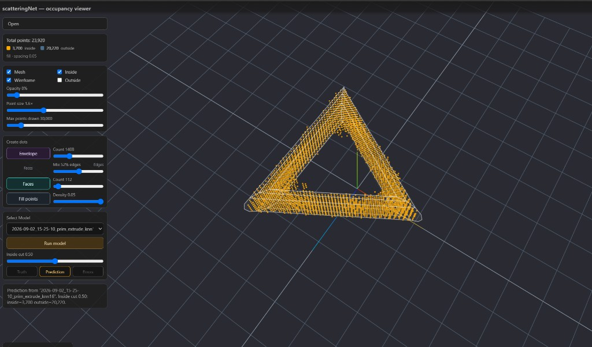</a> Primitive Geo</td>
<td align="center" valign="top" width="33%"><a href="media/2026-09-03_mixed_2.png">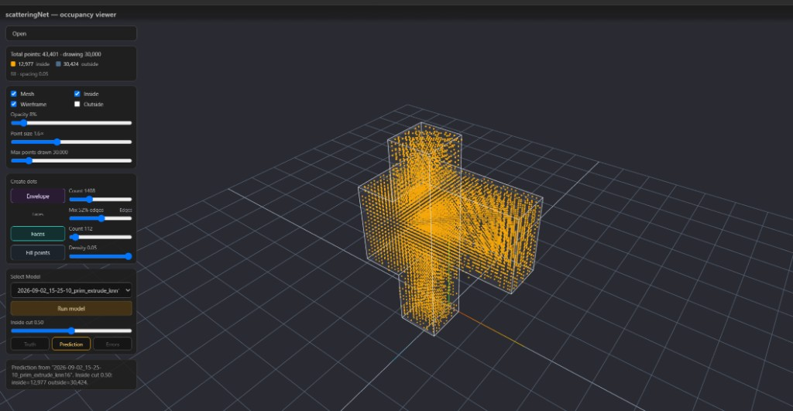</a> Extrude Geo lev 1</td>
<td align="center" valign="top" width="33%"><a href="media/2026-09-03_mixed_3.png">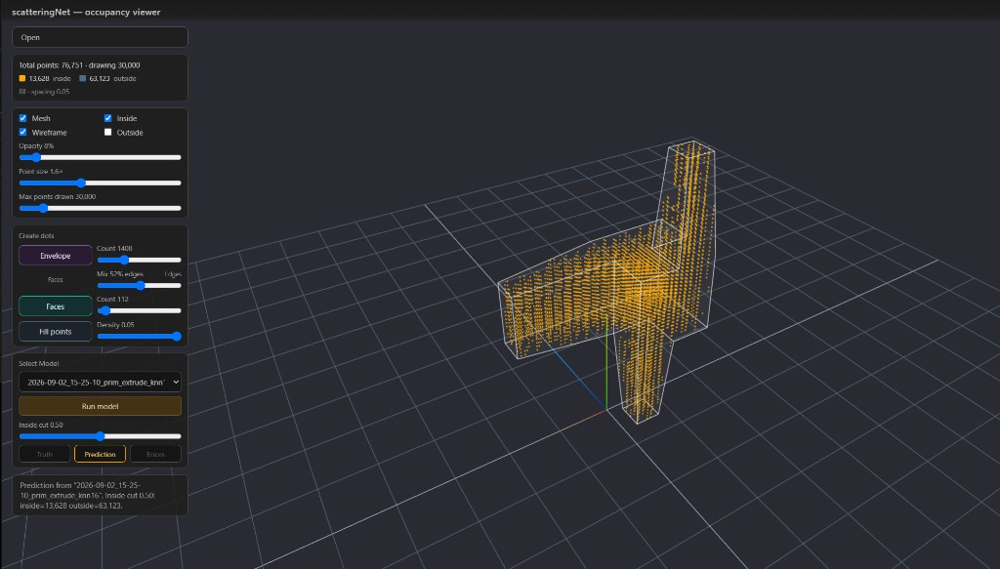</a> Extrude Geo lev 1</td>
</tr>
<tr>
<td align="center" valign="top" width="33%"><a href="media/2026-09-03_mixed_4.png">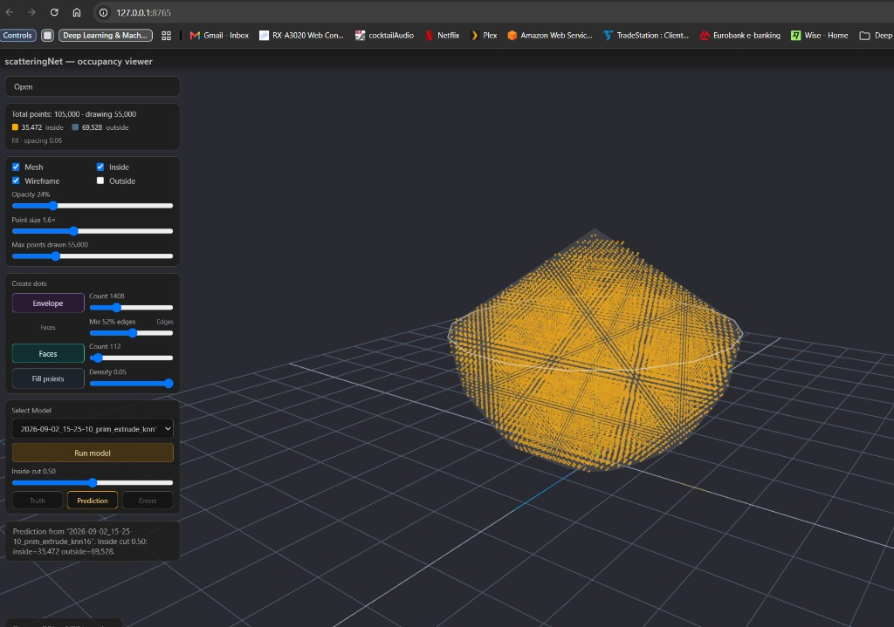</a> Primitive Geo</td>
<td align="center" valign="top" width="33%"><a href="media/2026-09-03_mixed_nr45_1.png">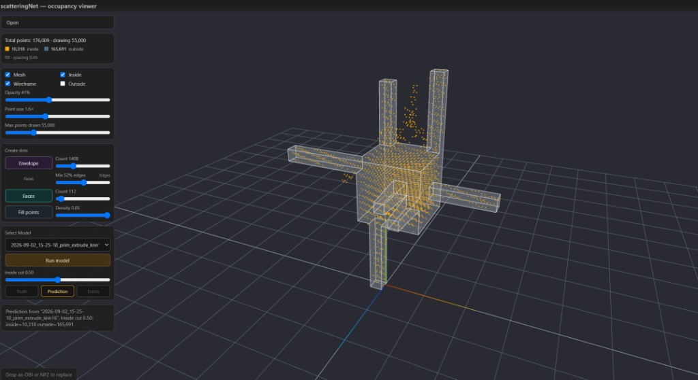</a> Extrude Geo lev 4/5</td>
<td align="center" valign="top" width="33%"><a href="media/2026-09-03_mixed_nr45_2.png">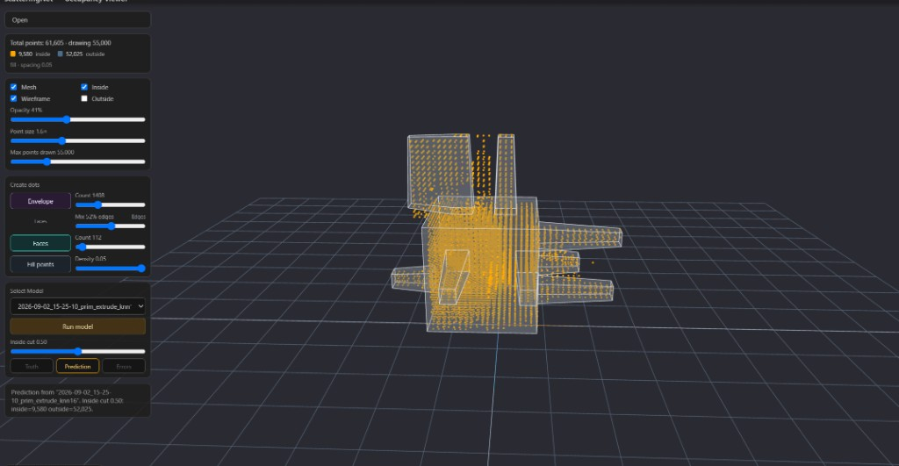</a> Extrude Geo lev 4/5</td>
</tr>
<tr>
<td align="center" valign="top" width="33%"><a href="media/2026-09-03_mixed_organic.png">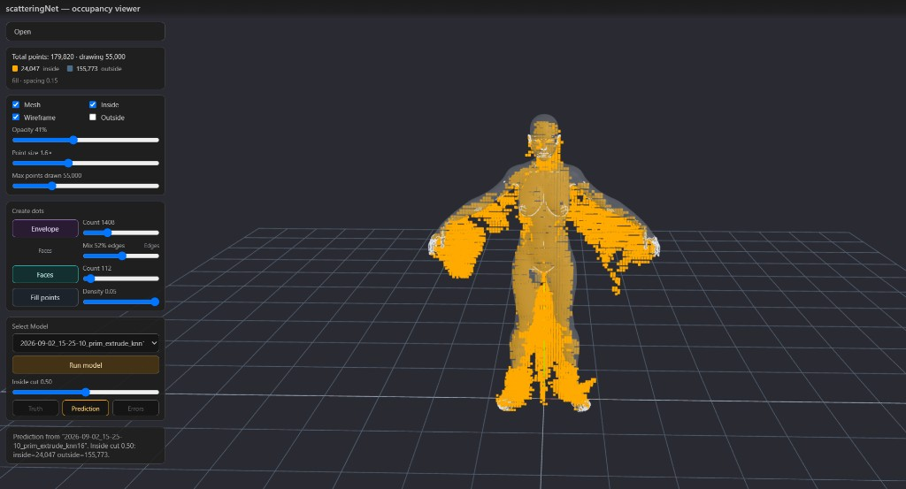</a> Not in that Train's Catalog</td>
<td></td>
<td></td>
</tr>
</table>

Selection stays `**checkpoint_metric: val_iou**`.

### What ran

| Knob       | Value                                                                                         |
| ---------- | --------------------------------------------------------------------------------------------- |
| Script     | `src/train_multi_npz.py` (from scratch; not a resume)                                         |
| Catalog    | YAML `npz_catalog`: primitive globs + `extrude_*_nr1_` cap 700 + `nr3` cap 100 + `nr4` cap 80 |
| `run_name` | `prim_extrude_knn16`                                                                          |
| Files      | 3526 NPZs, 1763 unique OBJs                                                                   |
| Geometry   | `n_surface=1024`, `envelope_mix=75`, `knn_k=16`, `shape_encoder=surface`                      |
| Split      | **Mesh** identity (`n_train_meshes=1410` / `n_val_meshes=353`, seed 1)                        |
| Model      | OccupancyEncoder `hidden=64` `depth=4`; local pool over 16 envelope offsets                   |
| Device     | `cuda` / NVIDIA GeForce GTX 1080                                                              |
| Optimizer  | Adam, `lr=0.001`                                                                              |
| Batch      | 1024                                                                                          |
| Epochs     | 20                                                                                            |
| Seed       | 1                                                                                             |
| Selection  | `checkpoint_metric: val_iou`                                                                  |

**Artifacts**

- Run: `runs/2026-09-02_15-25-10_prim_extrude_knn16/`
- Weights: `models/2026-09-02_15-25-10_prim_extrude_knn16/best.pt`
- Wall: **4h 32m 02.66s** (`started=2026-09-02T15:22:30` → `finished=2026-09-02T19:54:33`)
- `best_epoch: 20`, `best_metric: 0.953951` (val_iou)

**Bottom line:** mixed-catalog knn16 **won** holes + simple CAD. Do not compare 0.954 to `nr1` knn16 0.974 (different val). High-round arms and organics are later layers.

---

## 2026-09-03 12:00 — extrude_nr1_surface knn16 (`nr1` only)

Fresh train. `knn_k: 16`: each Fill point keeps the 16 nearest envelope offsets. **Cannot** resume mix-75 `best.pt` into this head. Goal: Fill **sleeves** on `nr1`.

### Fill (viewer) — 2 Sep 2026

Orange in `nr1` sleeves. Not in that Train's Catalog: round/helix, windows, harder parts.

<table>
<tr>
<td align="center" valign="top" width="33%"><a href="media/2026-09-02_knn16_nr1_sleeves_filled.png">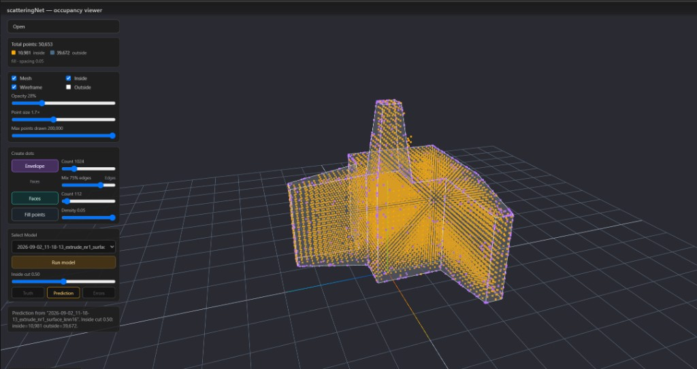</a> Sleeves filled</td>
<td align="center" valign="top" width="33%"><a href="media/2026-09-02_knn16_nr1_ood_1.png">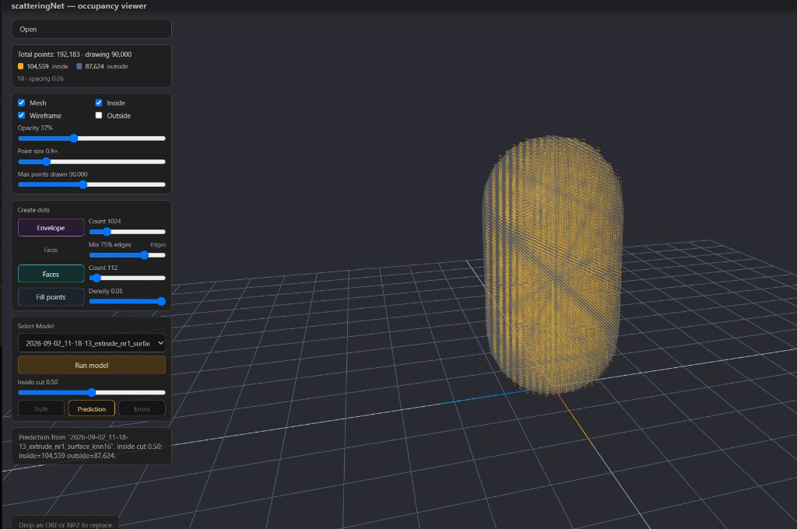</a> Not in that Train's Catalog</td>
<td align="center" valign="top" width="33%"><a href="media/2026-09-02_knn16_nr1_ood_2.png">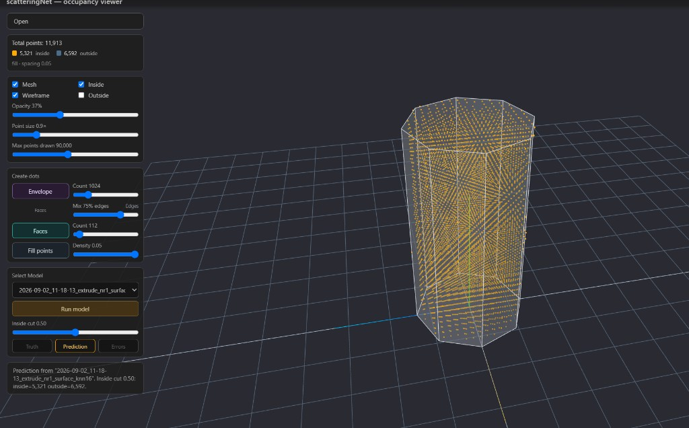</a> Not in that Train's Catalog</td>
</tr>
<tr>
<td align="center" valign="top" width="33%"><a href="media/2026-09-02_knn16_nr1_ood_3.png">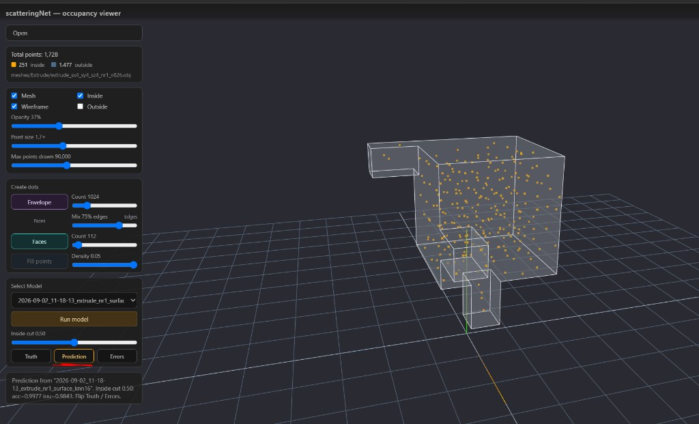</a> Extrude Geo lev 1</td>
<td align="center" valign="top" width="33%"><a href="media/2026-09-02_knn16_nr1_window.png">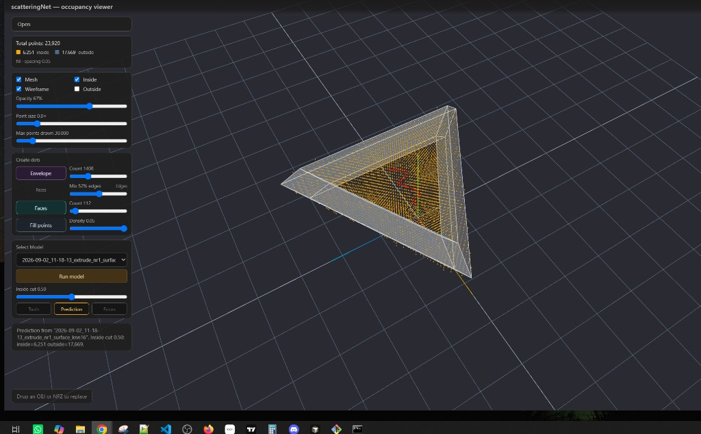</a> Not in that Train's Catalog</td>
<td align="center" valign="top" width="33%"><a href="media/2026-09-02_knn16_nr1_harder.png">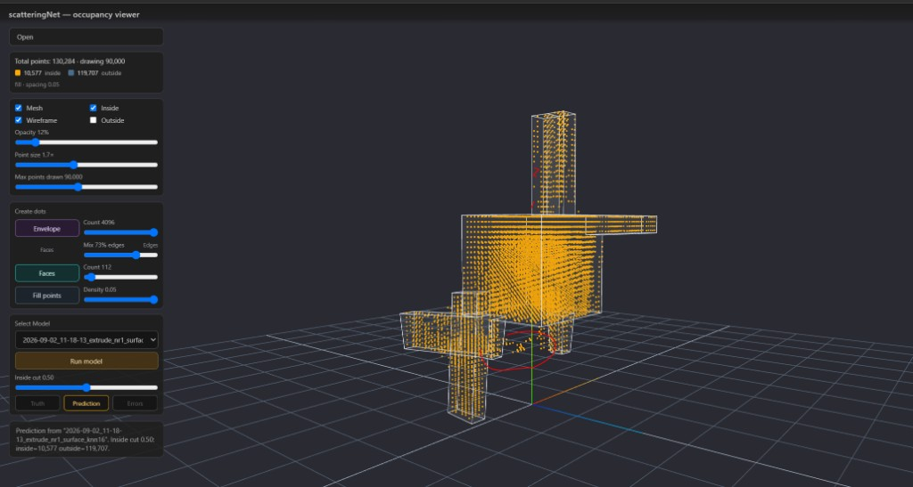</a> Harder extrude</td>
</tr>
</table>

### What ran

| Knob       | Value                                                                  |
| ---------- | ---------------------------------------------------------------------- |
| Script     | `src/train_multi_npz.py` (from scratch)                                |
| Glob       | `exports/dataset/extrude_*_nr1_*.npz`                                  |
| `run_name` | `extrude_nr1_surface_knn16`                                            |
| Files      | 5000 NPZs, 2500 unique OBJs                                            |
| Geometry   | `n_surface=1024`, `envelope_mix=75`, `knn_k=16`                        |
| Split      | **Mesh** identity (`n_train_meshes=2000` / `n_val_meshes=500`, seed 1) |
| Model      | OccupancyEncoder `hidden=64` `depth=4`                                 |
| Device     | `cuda` / NVIDIA GeForce GTX 1080                                       |
| Epochs     | 20                                                                     |
| Selection  | `checkpoint_metric: val_iou`                                           |

**Artifacts**

- Run: `runs/2026-09-02_11-18-13_extrude_nr1_surface_knn16/`
- Weights: `models/2026-09-02_11-18-13_extrude_nr1_surface_knn16/best.pt`
- Wall: **2h 16m 43.66s**
- `best_epoch: 19`, `best_metric: 0.973677` (val_iou)

**Bottom line:** local k-NN on `nr1` **won**. Epoch 1 already beat 40-epoch global mix 75 on this val.

---

## 2026-09-02 08:00 — extrude_nr1_surface mix75 look-see (epochs 29–40)

**Continuation of** `[2026-09-01_22-01-09_extrude_nr1_surface_mix75](#2026-09-01-2300--extrude_nr1_surface-mix75-continuation-epochs-2130)`. Same catalog, seed, mesh val, `h64/d4`, `envelope_mix: 75`. Loaded that run’s `best.pt` (**epoch 28**, val_iou 0.780), not the weaker epoch-30 weights from the same folder. Goal: does pushing the printed budget to 40 beat epoch 28, or has val rolled over?

A second folder `2026-09-02_07-40-54_extrude_nr1_surface_mix75` is the same resume started again the next morning (through epoch 35 when this was written, same numbers). Treat `**23-39-04**` as the completed look-see. Stop `07-40-54` if it is still running.

### What ran

| Knob         | Value                                                                                              |
| ------------ | -------------------------------------------------------------------------------------------------- |
| Script       | `src/train_multi_npz.py --resume-run-id 2026-09-01_22-01-09_extrude_nr1_surface_mix75 --epochs 12` |
| Parent       | `models/2026-09-01_22-01-09_extrude_nr1_surface_mix75/best.pt` (`resume_epoch: 28`)                |
| Extra epochs | 12 (printed 029–040). Snapshot `total: 40`                                                         |
| Device       | `cuda` / NVIDIA GeForce GTX 1080                                                                   |

**Artifacts**

- Run: `runs/2026-09-01_23-39-04_extrude_nr1_surface_mix75/`
- Weights: `models/2026-09-01_23-39-04_extrude_nr1_surface_mix75/best.pt`
- Wall: **1h 21m 51.63s** (`started=2026-09-01T23:37:15` → `finished=2026-09-02T00:59:06`)
- `best_epoch: 30`, `best_metric: 0.796476` (val_iou)

### Vs the parent

|                  | parent best @ 28 | parent’s own @ 30 | **this run best @ 30** | this run @ 40 |
| ---------------- | ---------------- | ----------------- | ---------------------- | ------------- |
| val_acc          | 0.9633           | 0.9590            | **0.9655**             | 0.9648        |
| val_iou / val_f1 | 0.780 / 0.877    | 0.774 / 0.872     | **0.796 / 0.887**      | 0.788 / 0.882 |
| train_acc        | 0.962            | 0.963             | 0.964                  | 0.966         |
| loss             | 0.087            | 0.086             | 0.085                  | 0.079         |

Two different stories:

1. **31–40 did not win.** Best stayed at 30. Epoch 33 got close (IoU 0.792); 34 dipped to 0.737; 40 finished at 0.788. Train loss and acc kept improving (`0.085 → 0.079`, `0.964 → 0.966`) while val never beat 30. That is the rollover we expected.
2. **This epoch 30 is not the parent’s epoch 30.** Resuming from the peak-28 weights and walking 29–30 again found a new high (IoU 0.796 vs the parent’s 0.774 at its own epoch 30, and vs 0.780 at 28). The look-see was not empty — the gain is the replay of 29–30, not the tail to 40.

**Not shown by this run**

- Viewer Fill vs `18-40-06` or the parent `22-01-09`
- That mix 50 / 100 would win
- That a lower LR after 30 would climb; this recipe is done

**Bottom line:** you were right that **nothing after 30 became `best.pt`**. Do not resume again. The file to keep is this run’s epoch-30 `best.pt` (IoU 0.796), which beats `22-01-09` epoch 28. That is the current occupancy numbers champion on `extrude_*_nr1`. Next useful work is Fill in the viewer, not epoch 41.

### Fill (viewer) — 2 Sep 2026 morning

Mix 75 still only fills the fat core; sleeves stay empty.

<table>
<tr>
<td align="center" valign="top" width="33%"><a href="media/2026-09-02_mix75_sleeves_outside_on.png">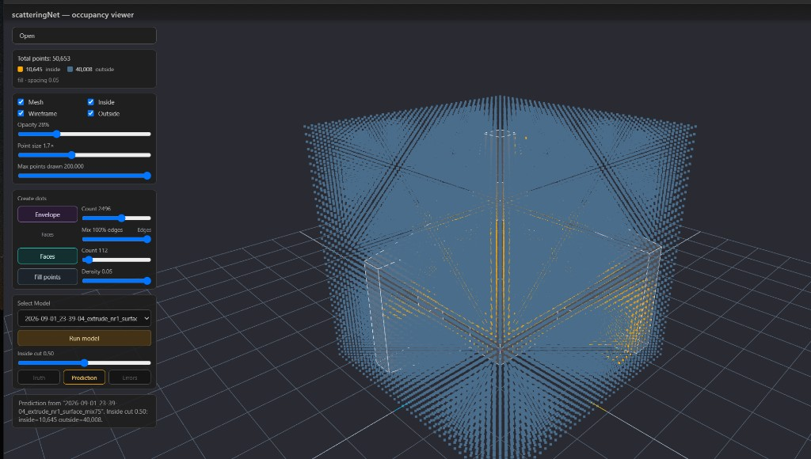</a> Fill Mode</td>
<td align="center" valign="top" width="33%"><a href="media/2026-09-02_mix75_sleeves_inside_only.png">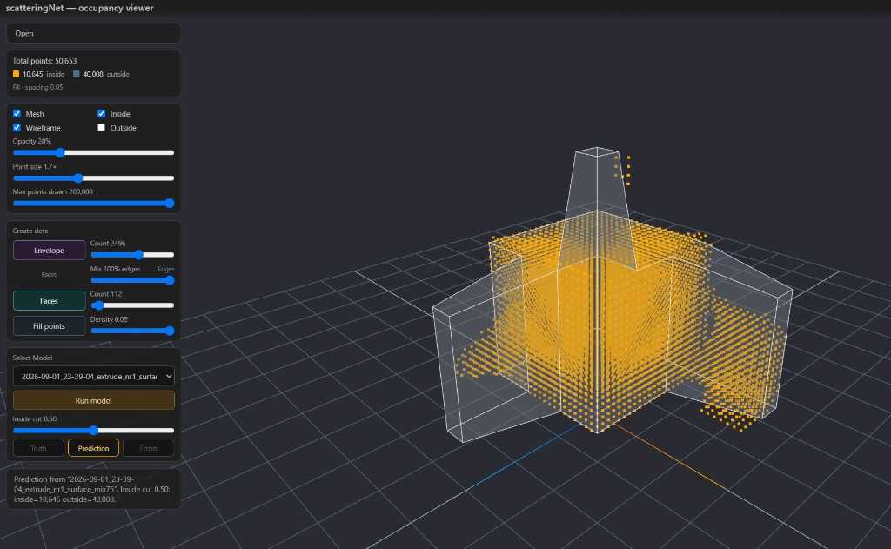</a> Failed to fill Extrude Level 1</td>
<td align="center" valign="top" width="33%"><a href="media/2026-09-02_mix75_still_global_1.png">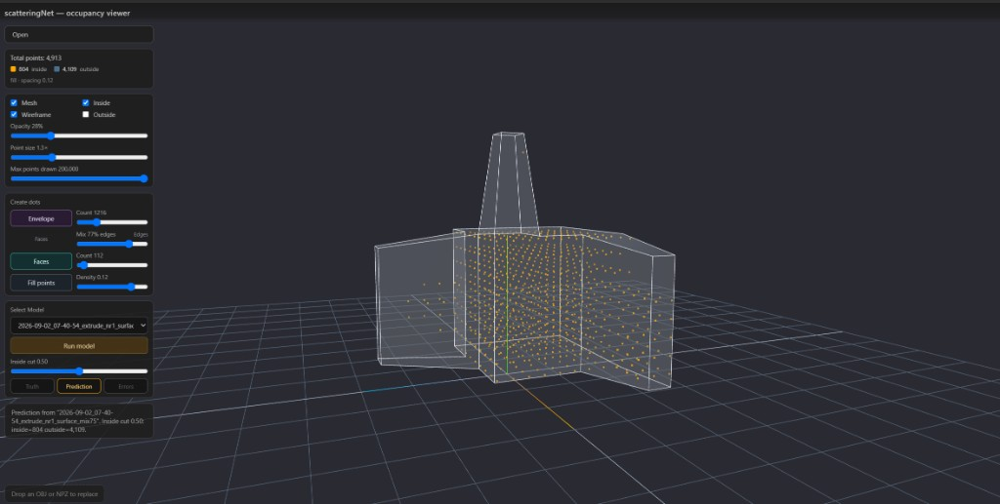</a> Failed to fill Extrude Level 1</td>
</tr>
<tr>
<td align="center" valign="top" width="33%"><a href="media/2026-09-02_mix75_still_global_2.png">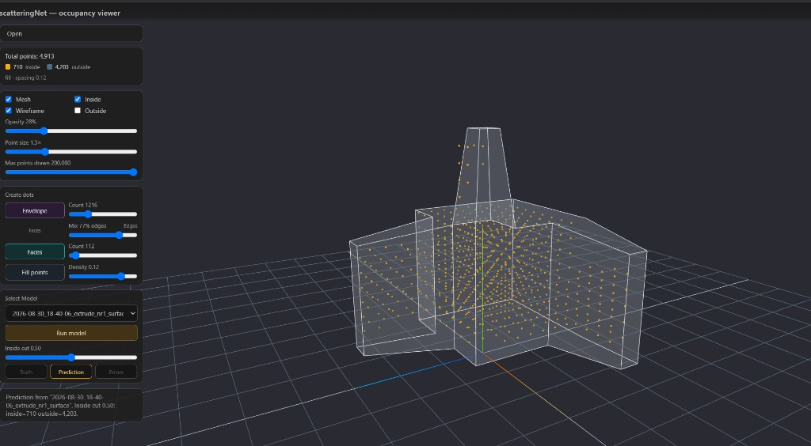</a> Failed to fill Extrude Level 1</td>
<td></td>
<td></td>
</tr>
</table>

---

## 2026-09-01 23:00 — extrude_nr1_surface mix75 continuation (epochs 21–30)

**Continuation of** `[2026-09-01_18-27-19_extrude_nr1_surface_mix75](#2026-09-01-2100--extrude_nr1_surface-mix75-crease-weighted-envelope)`. Same catalog, seed, mesh val, `h64/d4`, and `envelope_mix: 75`. Weights loaded from that run’s `best.pt` (epoch 20, val_iou 0.771). Not a new train from scratch. Goal: the parent was still rising at 20 — do 10 more epochs beat the area continuation `18-40-06` (best @ 25, IoU 0.775) at a matched 30-epoch budget?

Selection stays `**checkpoint_metric: val_iou**`. Parent `best.pt` stored Adam moments; optimizer resumed.

### What ran

| Knob         | Value                                                                                              |
| ------------ | -------------------------------------------------------------------------------------------------- |
| Script       | `src/train_multi_npz.py --resume-run-id 2026-09-01_18-27-19_extrude_nr1_surface_mix75 --epochs 10` |
| Parent       | `models/2026-09-01_18-27-19_extrude_nr1_surface_mix75/best.pt` (`resume_epoch: 20`)                |
| Split        | Same mesh holdout as the parent (seed 1, 2000 / 500 meshes)                                        |
| Extra epochs | 10 (printed 021–030). Snapshot `total: 30`                                                         |
| Device       | `cuda` / NVIDIA GeForce GTX 1080                                                                   |
| Geometry     | `envelope_mix=75` (unchanged)                                                                      |

**Artifacts**

- Run: `runs/2026-09-01_22-01-09_extrude_nr1_surface_mix75/`
- Weights: `models/2026-09-01_22-01-09_extrude_nr1_surface_mix75/best.pt`
- Wall: **1h 06m 29.73s** (`started=2026-09-01T21:57:43` → `finished=2026-09-01T23:04:12`)
- `best_epoch: 28`, `best_metric: 0.780496` (val_iou)

### Vs the parent and the area continuation

|                  | mix 75 parent @ 20 | **this run best @ 28** | this run @ 30 | area `18-40-06` @ 25 |
| ---------------- | ------------------ | ---------------------- | ------------- | -------------------- |
| val_acc          | 0.9608             | **0.9633**             | 0.9590        | 0.9624               |
| val_iou / val_f1 | 0.771 / 0.870      | **0.780 / 0.877**      | 0.774 / 0.872 | 0.775 / 0.873        |
| train_acc        | 0.959              | 0.962                  | 0.963         | 0.960                |
| loss             | 0.096              | 0.087                  | 0.086         | 0.093                |

Epoch 21 dipped (val_iou 0.737) then recovered. Epoch 22 already beat the parent (0.774). Epoch 25 was already past `18-40-06` (IoU 0.780 vs 0.775). Best is epoch **28**. After that, train acc and loss keep improving while val wobbles and finishes **below** 28 — same rollover as the area recipe after 25. Use epoch 28, not 30, and not the parent epoch-20 file.

**Not shown by this run**

- Viewer Fill vs `18-40-06` (numbers only)
- That mix 50 or 100 would win
- That 10 more epochs would help; val already rolled over

**Bottom line:** the extra 10 epochs bought a **small, real** gain, and mix 75 now **beats** the old area inspect checkpoint on the matched 30-epoch budget (IoU 0.780 vs 0.775). This `best.pt` (epoch 28) is the current occupancy numbers champion on `extrude_*_nr1`. Another resume on this recipe is not justified. Inspect default can move here after a Fill look; until then keep `18-40-06` only if the viewer still looks better.

---

## 2026-09-01 21:00 — extrude_nr1_surface mix75 (crease-weighted envelope)

Fresh train. Same catalog, seed, mesh val, occupancy `h64/d4`, Adam `lr=0.001`, and `n_surface: 1024` as `15-50-05`. The only geometry change is `**envelope_mix: 75**`: of 1024 shell points, ~256 are area-weighted face darts (old envelope) and ~768 hug sharp creases. OccupancyMLP / OccupancyEncoder unchanged. Goal: does putting most envelope mass on edges beat the 20-epoch area envelope on the same holdout?

Selection is `**checkpoint_metric: val_iou**` (`15-50-05` used `val_acc`). Both runs’ `best.pt` is epoch 20, so the epoch-20 row is a matched comparison.

### What ran

| Knob       | Value                                                                                              |
| ---------- | -------------------------------------------------------------------------------------------------- |
| Script     | `src/train_multi_npz.py` (from scratch; not a resume)                                              |
| Glob       | YAML `exports/dataset/extrude_*_nr1_*.npz`                                                         |
| `run_name` | `extrude_nr1_surface_mix75`                                                                        |
| Files      | 5000 NPZs, 2500 unique OBJs (`max_files_per_shape: 2`)                                             |
| Geometry   | `n_surface=1024`, `envelope_mix=75`, `shape_encoder=surface` (`n_faces` unused by this head)       |
| Split      | **Mesh** identity (`n_train_meshes=2000` / `n_val_meshes=500`, seed 1) — same groups as `15-50-05` |
| Model      | OccupancyEncoder `hidden=64` `depth=4` (`latent_dim` omitted → 64)                                 |
| Device     | `cuda` / NVIDIA GeForce GTX 1080                                                                   |
| Optimizer  | Adam, `lr=0.001`                                                                                   |
| Batch      | 1024                                                                                               |
| Epochs     | 20                                                                                                 |
| Seed       | 1                                                                                                  |
| Selection  | `checkpoint_metric: val_iou`                                                                       |

**Artifacts**

- Run: `runs/2026-09-01_18-27-19_extrude_nr1_surface_mix75/`
- Weights: `models/2026-09-01_18-27-19_extrude_nr1_surface_mix75/best.pt`
- Wall: **2h 13m 22.08s** (`started=2026-09-01T18:23:19` → `finished=2026-09-01T20:36:41`)
- `best_epoch: 20`, `best_metric: 0.770542` (val_iou)

### Vs 20-epoch area envelope (same split)

Do **not** treat a win over `10-38-57` (mesh tokens, IoU 0.691) as the story. That run already lost. The matched recipe is `15-50-05` (`envelope_mix` omitted = 0). `18-40-06` is 10 extra epochs on that area envelope, not a matched budget.

|                       | area envelope (`15-50-05`)   | **mix 75 (`18-27-19`)**          | area + 10 epochs (`18-40-06` @ 25) |
| --------------------- | ---------------------------- | -------------------------------- | ---------------------------------- |
| best val_acc          | 0.9584 @ 20 (`val_acc` pick) | **0.9608 @ 20** (`val_iou` pick) | 0.9624 @ 25                        |
| best val_iou / f1     | 0.756 / 0.861                | **0.771 / 0.870**                | 0.775 / 0.873                      |
| epoch-20 val_acc      | 0.9584                       | **0.9608**                       | —                                  |
| epoch-20 val_iou / f1 | 0.756 / 0.861                | **0.771 / 0.870**                | —                                  |
| epoch-20 loss         | 0.098                        | **0.096**                        | 0.093 @ 25                         |
| wall                  | 2h 14m                       | 2h 13m                           | +1h (epochs 21–30)                 |

Loss falls `0.241 → 0.096`. Train and val stay together (train acc 0.959 vs val 0.961 at 20). Val IoU still wobbles mid-run (dips at 12 and 15), same pattern as the area envelope, then a clean last-epoch best. It **beats** the matched 20-epoch area train: IoU +0.015, acc +0.002. At 20 epochs it is already within ~0.004 IoU of `18-40-06` epoch 25.

Unlike `18-40-06`, this run is still **rising** at the last epoch (best = 20). A 10-epoch resume is more justified here than another resume of the area recipe.

**Not shown by this run**

- That mix 50 or 100 would win (this is one mix value)
- Viewer Fill quality vs `18-40-06` (numbers only; inspect still needs a look)
- A mixed-family catalog (still `extrude_*_nr1` only)

**Bottom line:** crease-weighted envelope at mix 75 **won** the 20-epoch match vs `15-50-05`. Keep `15-50-05` as the area-envelope baseline. This `best.pt` is the better 20-epoch surface checkpoint. Do not auto-replace `18-40-06` as the inspect default until Fill is compared; that file still has a small IoU edge from 10 extra epochs. Optional next: resume 10 epochs on `18-27-19`, or A/B mix 50 / 100 — not another mesh-token train.

---

## 2026-09-01 14:00 — extrude_nr1_mesh (face tokens)

Fresh train. Same catalog, seed, mesh val, occupancy `h64/d4`, and Adam `lr=0.001` as `15-50-05`. The geometry signal is **face tokens**, not the envelope: `shape_encoder: mesh`, `n_faces: 256` (largest triangles by area, tiled if short). `MeshFaceEncoder` is a per-face MLP + **global max-pool** → one `z_face`; occupancy is `cat(xyz, z_face)`. Goal: does this beat the 20-epoch envelope baseline on the same holdout?

Selection this run is `**checkpoint_metric: val_iou**` (surface trains used `val_acc`). Compare IoU to IoU; do not treat a `val_acc` `best.pt` as the same pick rule.

### What ran

| Knob       | Value                                                                                                                     |
| ---------- | ------------------------------------------------------------------------------------------------------------------------- |
| Script     | `src/train_multi_npz.py` (from scratch; not a resume)                                                                     |
| Glob       | YAML `exports/dataset/extrude_*_nr1_*.npz`                                                                                |
| `run_name` | `extrude_nr1_mesh`                                                                                                        |
| Files      | 5000 NPZs, 2500 unique OBJs (`max_files_per_shape: 2`)                                                                    |
| Geometry   | `n_faces=256`, `shape_encoder=mesh` (`n_surface=1024` is still in YAML; unused by this head)                              |
| Split      | **Mesh** identity (`n_train_meshes=2000` / `n_val_meshes=500`, seed 1) — same groups as `15-50-05`                        |
| Model      | OccupancyEncoder `hidden=64` `depth=4`; MeshFaceEncoder `encoder_hidden=64` `encoder_depth=4` (`latent_dim` omitted → 64) |
| Device     | `cuda` / NVIDIA GeForce GTX 1080                                                                                          |
| Optimizer  | Adam, `lr=0.001`                                                                                                          |
| Batch      | 1024                                                                                                                      |
| Epochs     | 20                                                                                                                        |
| Seed       | 1                                                                                                                         |
| Selection  | `checkpoint_metric: val_iou`                                                                                              |

**Artifacts**

- Run: `runs/2026-09-01_10-38-57_extrude_nr1_mesh/`
- Weights: `models/2026-09-01_10-38-57_extrude_nr1_mesh/best.pt`
- Wall: **2h 11m 24.65s** (`started=2026-09-01T10:36:55` → `finished=2026-09-01T12:48:19`)
- `best_epoch: 19`, `best_metric: 0.691164` (val_iou)

### Vs 20-epoch envelope (same split)

Do **not** score this against `18-40-06` epoch 25 as a matched A/B. That run is 10 extra epochs on envelope `h64/d4`. The matched budget is `15-50-05`.

|                       | envelope h64 d4 (`15-50-05`) | **mesh faces (`10-38-57`)**  |
| --------------------- | ---------------------------- | ---------------------------- |
| best val_acc          | 0.9584 @ 20 (`val_acc` pick) | 0.9463 @ 19 (`val_iou` pick) |
| best val_iou / f1     | 0.756 / 0.861                | **0.691 / 0.817**            |
| epoch-20 val_acc      | 0.9584                       | 0.9399                       |
| epoch-20 val_iou / f1 | 0.756 / 0.861                | 0.662 / 0.797                |
| epoch-20 loss         | 0.098                        | 0.130                        |
| wall                  | 2h 14m                       | 2h 11m                       |

Loss falls `0.269 → 0.130`. Train and val stay together. It learns interiors (not the ~85% outside prior), but it **loses** the matched envelope train: IoU 0.691 vs 0.756, acc 0.946 vs 0.958. Epoch 20 is worse on val than 19 (IoU 0.662) while train acc and loss still improve slightly — early wobble, not a reason to resume 10 more epochs as the main bet.

Viewer Fill at spacing 0.05 (qualitative, not a metric): this `best.pt` underfills vs `18-40-06` (holes, empty chimney). Do not promote it as the inspect default.

**Not shown by this run**

- That local query–face attention would lose (this encoder is global max-pool over 256 largest faces)
- That more epochs on this recipe would catch `15-50-05` or `18-40-06`
- A mixed-family catalog (still `extrude_*_nr1` only)

**Bottom line:** Step 10 mesh tokens at this recipe **lost**. Keep `15-50-05` as the 20-epoch envelope baseline and `18-40-06` epoch 25 as the inspect checkpoint. Do not treat `10-38-57` as the new baseline. Next geometry work, if any, is a stronger local face encoder — not another 10 epochs of global max-pool.

### Fill (viewer) — 1 Sep 2026

Envelope looked better than face tokens on the same meshes.

<table>
<tr>
<td align="center" valign="top" width="33%"><a href="media/2026-09-01_mesh_vs_envelope_1.png">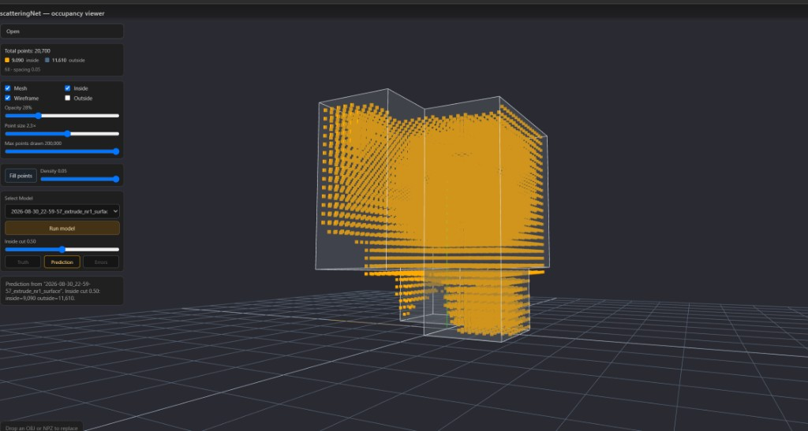</a>  Partial filling of Extrude lev 1</td>
<td align="center" valign="top" width="33%"><a href="media/2026-09-01_mesh_vs_envelope_2.png">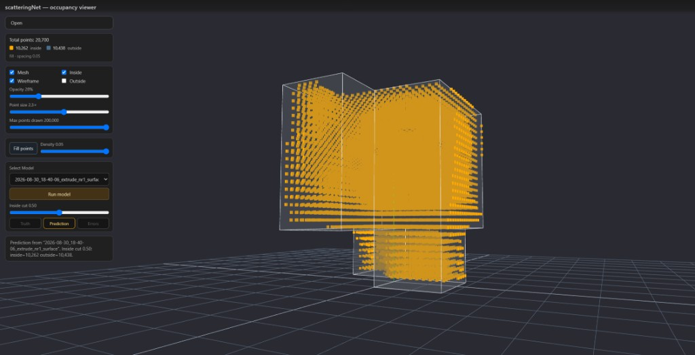</a>  Partial filling of Extrude lev 1</td>
<td align="center" valign="top" width="33%"><a href="media/2026-09-01_mesh_vs_envelope_3.png">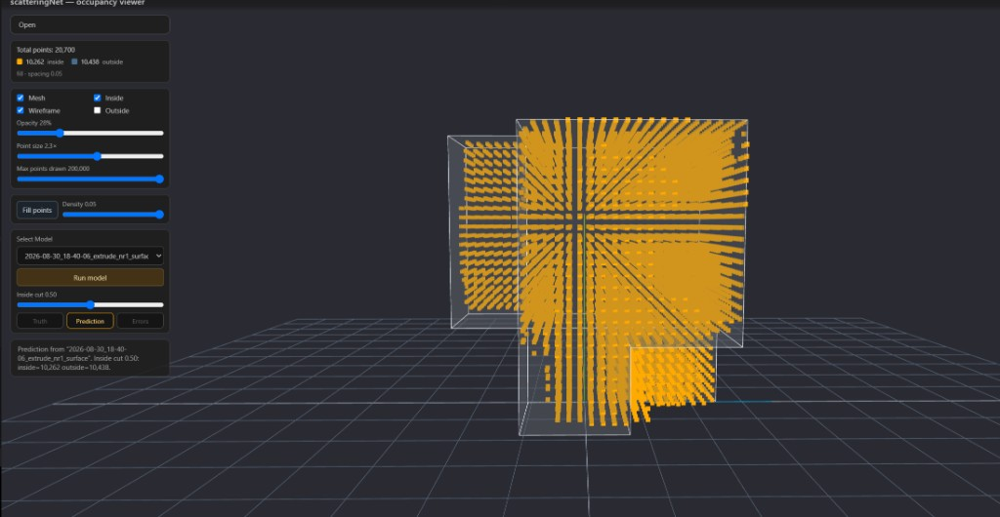</a>  Partial filling of Extrude lev 1</td>
</tr>
</table>

---

## 2026-08-31 09:00 — extrude_nr1_surface hidden 128 depth 6 (width+depth A/B)

Fresh train. Same catalog, seed, mesh val, and envelope as `15-50-05` and `20-31-00`. Knobs: `**hidden: 128**` and `**depth: 6**` (baseline is 64 / 4). `latent_dim` omitted, so encoder `z` is 128. Goal: does extra width **and** depth beat the 20-epoch surface baseline on this holdout?

### What ran

| Knob       | Value                                                                                              |
| ---------- | -------------------------------------------------------------------------------------------------- |
| Script     | `src/train_multi_npz.py` (from scratch; not a resume)                                              |
| Glob       | YAML `exports/dataset/extrude_*_nr1_*.npz`                                                         |
| `run_name` | `extrude_nr1_surface`                                                                              |
| Files      | 5000 NPZs, 2500 unique OBJs (`max_files_per_shape: 2`)                                             |
| Envelope   | `n_surface=1024`, `shape_encoder=surface`                                                          |
| Split      | **Mesh** identity (`n_train_meshes=2000` / `n_val_meshes=500`, seed 1) — same groups as `15-50-05` |
| Model      | OccupancyEncoder `hidden=128` `depth=6` `latent_dim=128`                                           |
| Device     | `cuda` / NVIDIA GeForce GTX 1080                                                                   |
| Optimizer  | Adam, `lr=0.001`                                                                                   |
| Batch      | 1024                                                                                               |
| Epochs     | 20                                                                                                 |
| Seed       | 1                                                                                                  |
| Selection  | `checkpoint_metric: val_acc`                                                                       |

**Artifacts**

- Run: `runs/2026-08-30_22-59-57_extrude_nr1_surface/`
- Weights: `models/2026-08-30_22-59-57_extrude_nr1_surface/best.pt`
- Wall: **2h 27m 57.54s** (`started=2026-08-30T22:57:53` → `finished=2026-08-31T01:25:50`)
- `best_epoch: 19`, `best_metric: 0.959084`

### Vs the other 20-epoch surface trains (same split)

Do **not** score this against `18-40-06` epoch 25. That run is 10 extra epochs on `h64/d4`, not a matched architecture A/B.

|                       | h64 d4 (`15-50-05`) | h128 d4 (`20-31-00`) | **h128 d6 (`22-59-57`)** |
| --------------------- | ------------------- | -------------------- | ------------------------ |
| best val_acc          | 0.9584 @ 20         | 0.9586 @ 18          | **0.9591 @ 19**          |
| best val_iou / f1     | 0.756 / 0.861       | 0.757 / 0.861        | 0.754 / 0.860            |
| epoch-20 val_acc      | 0.9584              | 0.9567               | 0.9577                   |
| epoch-20 val_iou / f1 | 0.756 / 0.861       | 0.759 / 0.863        | **0.768 / 0.869**        |
| epoch-20 loss         | 0.098               | 0.092                | 0.092                    |
| wall                  | 2h 14m              | 2h 17m               | 2h 28m                   |

Loss falls `0.244 → 0.092`. Train and val stay together. It learns interiors. At a matched 20-epoch budget it is **tied** with the small net — a 0.0007 acc bump, not a result. `best.pt` is epoch 19 (val_acc). Epoch 20 is slightly worse on acc but better on IoU (0.768). Selection follows `val_acc`, so 19 is the checkpoint.

**Not shown by this run**

- That more epochs on this recipe would or would not match `18-40-06` (this train stopped at 20)
- A new geometry signal (still the same envelope + extrude family)

**Bottom line:** extra width and depth did **not** move the 20-epoch score. Keep `15-50-05` as the 20-epoch surface baseline. `18-40-06` epoch 25 remains the longest-trained surface checkpoint we have, not proof that `h64/d4` is the better architecture. Do not treat `22-59-57` as the baseline.

### Fill (viewer) — 31 Aug 2026

First occupancy-viewer Fill: fat core filled, arms empty. Last three surface models looked alike.

<table>
<tr>
<td align="center" valign="top" width="33%"><a href="media/2026-08-31_envelope_era_xtrude_core.png">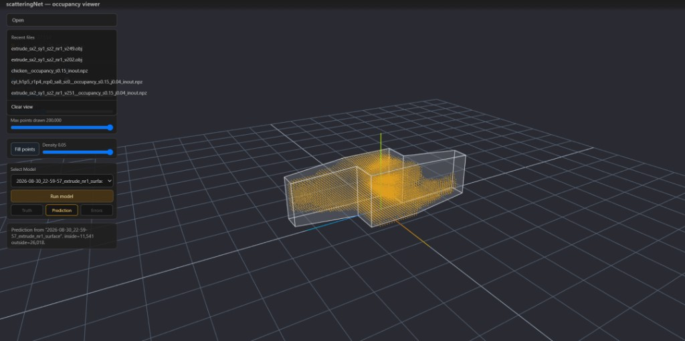</a> Core filled, arms empty</td>
<td align="center" valign="top" width="33%"><a href="media/2026-08-31_envelope_era_extrude_b.png">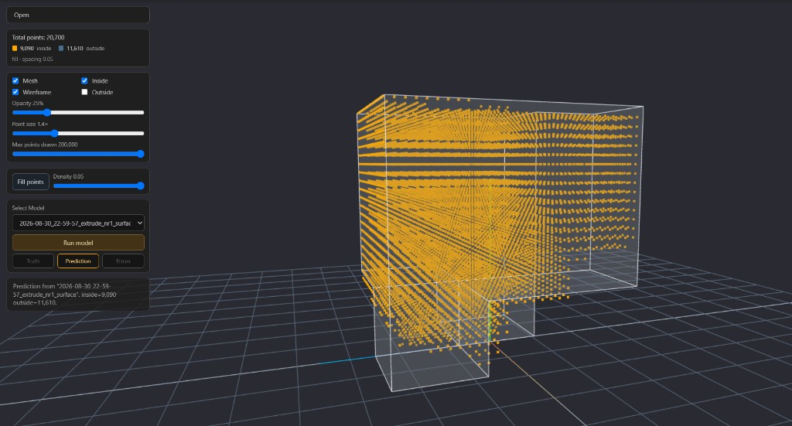</a> Partial fill \ leakage of points from extrude level 1</td>
<td align="center" valign="top" width="33%"><a href="media/2026-08-31_envelope_era_extrude_c.png">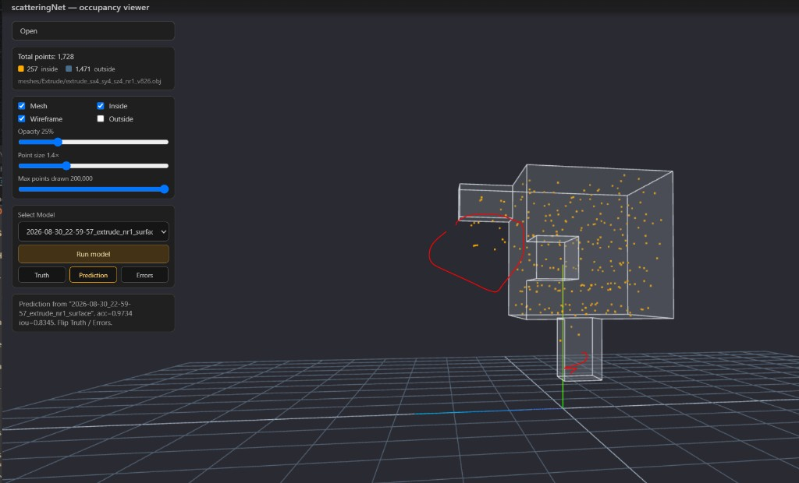</a> Partial fill \ leakage of points from extrude level 1</td>
</tr>
<tr>
<td align="center" valign="top" width="33%"><a href="media/2026-08-31_envelope_era_compare_1.png">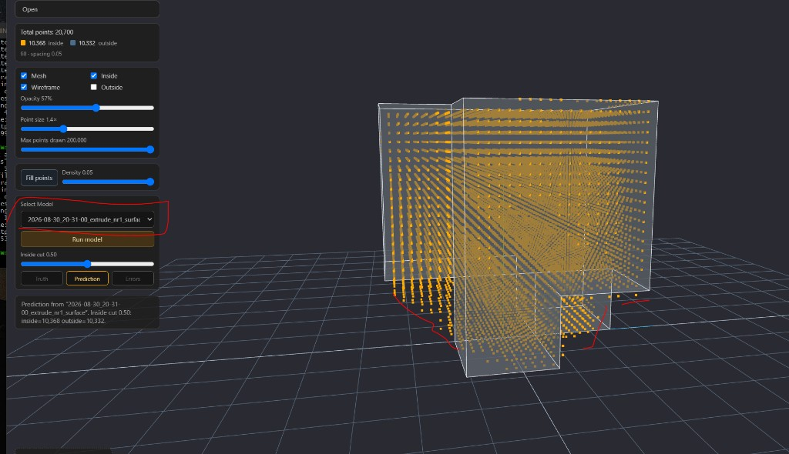</a> Partial fill \ leakage of points from extrude level 1</td>
<td align="center" valign="top" width="33%"><a href="media/2026-08-31_envelope_era_compare_2.png">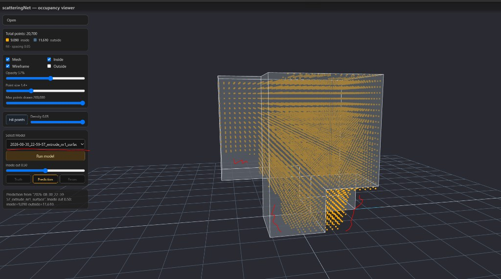</a> Partial fill \ leakage of points from extrude level 1</td>
<td align="center" valign="top" width="33%"><a href="media/2026-08-31_envelope_era_compare_3.png">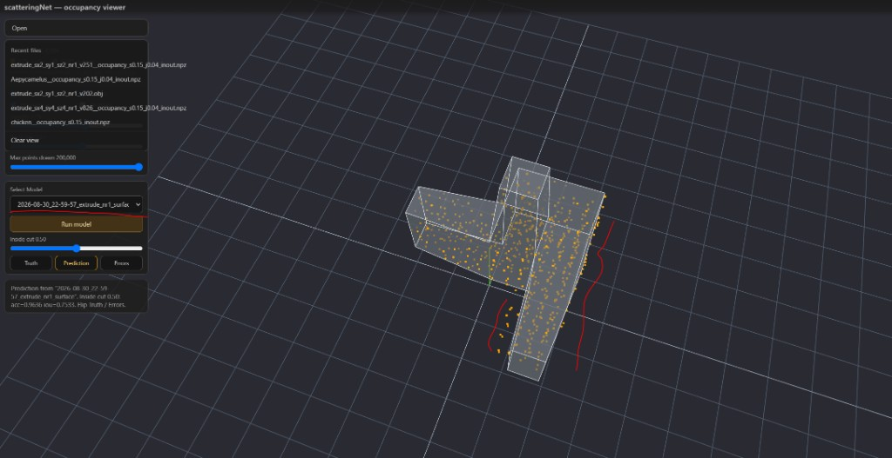</a> Partial fill \ leakage of points from extrude level 1</td>
</tr>
</table>

---

## 2026-08-30 22:00 — extrude_nr1_surface hidden 128 (width A/B)

Fresh train. Same catalog, seed, mesh val, envelope, and `depth: 4` as `15-50-05`. Only `**hidden: 128**` (was 64). `latent_dim` omitted, so encoder `z` is also 128. Goal: does doubling width beat the narrow surface baseline on this holdout?

### What ran

| Knob       | Value                                                                                              |
| ---------- | -------------------------------------------------------------------------------------------------- |
| Script     | `src/train_multi_npz.py` (from scratch; not a resume)                                              |
| Glob       | YAML `exports/dataset/extrude_*_nr1_*.npz`                                                         |
| `run_name` | `extrude_nr1_surface`                                                                              |
| Files      | 5000 NPZs, 2500 unique OBJs (`max_files_per_shape: 2`)                                             |
| Envelope   | `n_surface=1024`, `shape_encoder=surface`                                                          |
| Split      | **Mesh** identity (`n_train_meshes=2000` / `n_val_meshes=500`, seed 1) — same groups as `15-50-05` |
| Model      | OccupancyEncoder `hidden=128` `depth=4` `latent_dim=128`                                           |
| Device     | `cuda` / NVIDIA GeForce GTX 1080                                                                   |
| Optimizer  | Adam, `lr=0.001`                                                                                   |
| Batch      | 1024                                                                                               |
| Epochs     | 20                                                                                                 |
| Seed       | 1                                                                                                  |
| Selection  | `checkpoint_metric: val_acc`                                                                       |

**Artifacts**

- Run: `runs/2026-08-30_20-31-00_extrude_nr1_surface/`
- Weights: `models/2026-08-30_20-31-00_extrude_nr1_surface/best.pt`
- Wall: **2h 16m 57.15s** (`started=2026-08-30T20:30:29` → `finished=2026-08-30T22:47:26`)
- `best_epoch: 18`, `best_metric: 0.958587`

### Vs `hidden: 64` (same split)

|                   | h64 @ 20 (`15-50-05`) | **h128 @ 20 (`20-31-00`)** |
| ----------------- | --------------------- | -------------------------- |
| best val_acc      | 0.9584 @ 20           | 0.9586 @ 18                |
| best val_iou / f1 | 0.756 / 0.861         | 0.757 / 0.861              |
| epoch-20 val_acc  | 0.9584                | 0.9567                     |
| epoch-20 loss     | 0.098                 | 0.092                      |
| wall              | 2h 14m                | 2h 17m                     |

Loss falls `0.246 → 0.092`. Train and val stay together. It learns interiors, but it does **not** beat the 64-wide net at the same epoch budget. Best is epoch 18; 19–20 are slightly worse. Do **not** score this against `18-40-06` epoch 25 — that is more epochs on `h64/d4`, not a width A/B.

**Not shown by this run**

- That `hidden: 256` would help (this A/B says width is not the bottleneck at 20 epochs)
- A depth change (`depth` stayed 4; see `22-59-57`)
- That more epochs on `h128` would or would not catch the `h64` continuation

**Bottom line:** at a matched 20-epoch budget, doubling width was **neutral** vs `15-50-05`. Keep `15-50-05` as the 20-epoch surface baseline. `18-40-06` epoch 25 remains the longest-trained surface checkpoint, not the architecture winner. Do not treat `20-31-00` as the baseline.

---

## 2026-08-30 20:00 — extrude_nr1_surface continuation (epochs 21–30)

**Continuation of** `[2026-08-30_15-50-05_extrude_nr1_surface](#2026-08-30-1800--extrude_nr1_surface-mesh-identity-val-hygiene-replay)`. Same catalog, seed, mesh val split, and envelope head. Weights loaded from that run’s `best.pt` (epoch 20, val acc 0.9584). Not a new train from scratch. Goal: the parent run was still rising at epoch 20 — do 10 more epochs help?

### What ran

| Knob         | Value                                                                                        |
| ------------ | -------------------------------------------------------------------------------------------- |
| Script       | `src/train_multi_npz.py --resume-run-id 2026-08-30_15-50-05_extrude_nr1_surface --epochs 10` |
| Parent       | `models/2026-08-30_15-50-05_extrude_nr1_surface/best.pt` (`resume_epoch: 20`)                |
| Split        | Same mesh holdout as the parent (seed 1, 2000 / 500 meshes)                                  |
| Extra epochs | 10 (printed 021–030). Snapshot `total: 30`                                                   |
| Device       | `cuda` / NVIDIA GeForce GTX 1080                                                             |
| Note         | Parent `best.pt` had no Adam moments; optimizer restarted, weights did not                   |

**Artifacts**

- Run: `runs/2026-08-30_18-40-06_extrude_nr1_surface/`
- Weights: `models/2026-08-30_18-40-06_extrude_nr1_surface/best.pt`
- Wall: **1h 00m 37.62s** (`started=2026-08-30T18:39:35` → `finished=2026-08-30T19:40:12`)
- `best_epoch: 25`, `best_metric: 0.962418`

### Vs the parent (`15-50-05`)

|                  | Parent epoch 20 | This run best (25) | This run epoch 30 |
| ---------------- | --------------- | ------------------ | ----------------- |
| val_acc          | 0.9584          | **0.9624**         | 0.9559            |
| val_iou / val_f1 | 0.756 / 0.861   | **0.775 / 0.873**  | 0.762 / 0.865     |
| train_acc        | 0.958           | 0.960              | 0.962             |
| loss             | 0.098           | 0.093              | 0.089             |

Epoch 21 already beat the parent (`val_acc=0.9592`). Best is epoch **25**. After that, train acc and loss keep improving while val wobbles and finishes **below** 25. That is the start of overfitting, not another climb.

**Not shown by this run**

- A new architecture or split (this is only more epochs on the parent weights)
- That 20 more epochs would help; val already rolled over

**Bottom line:** the extra 10 epochs bought a **small** gain. Use this run’s `best.pt` (epoch 25), not epoch 30 and not the parent epoch-20 file, as the current surface checkpoint. Another resume on this recipe is not justified.

---

## 2026-08-30 18:00 — extrude_nr1_surface (mesh-identity val, hygiene replay)

Same catalog, seed, and envelope head as `2026-08-29_19-43-15_extrude_nr1_surface`. This run is the first full catalog train **after hygiene**: unique-OBJ val, shared per-mesh AABB, point micro-average metrics, `val_`* names. Goal: does the envelope still learn interiors when the same OBJ cannot leak across the split?

### What ran

| Knob       | Value                                                                                                                       |
| ---------- | --------------------------------------------------------------------------------------------------------------------------- |
| Script     | `src/train_multi_npz.py`                                                                                                    |
| Glob       | YAML `exports/dataset/extrude_*_nr1_*.npz`                                                                                  |
| `run_name` | `extrude_nr1_surface`                                                                                                       |
| Files      | 5000 NPZs, 2500 unique OBJs (`max_files_per_shape: 2`)                                                                      |
| Envelope   | `n_surface=1024`, `shape_encoder=surface` (`latent_dim` omitted → 64)                                                       |
| Points     | `N=11522442` (`n_train=9195763` / `n_val=2326679`)                                                                          |
| Split      | **Mesh** identity (`n_train_meshes=2000` / `n_val_meshes=500`, `val_fraction=0.20`). Both NPZs of one OBJ stay on one side. |
| Model      | OccupancyEncoder `hidden=64` `depth=4` `latent_dim=64`                                                                      |
| Device     | `cuda` / NVIDIA GeForce GTX 1080                                                                                            |
| Optimizer  | Adam, `lr=0.001`                                                                                                            |
| Batch      | 1024                                                                                                                        |
| Epochs     | 20                                                                                                                          |
| Seed       | 1                                                                                                                           |
| Selection  | `checkpoint_metric: val_acc`                                                                                                |

**Artifacts**

- Run: `runs/2026-08-30_15-50-05_extrude_nr1_surface/` (`config.yaml`, `catalog.txt` 5000 lines, `metrics.jsonl`)
- Weights: `models/2026-08-30_15-50-05_extrude_nr1_surface/best.pt`
- Wall: **2h 13m 30.70s** (`started=2026-08-30T15:49:36` → `finished=2026-08-30T18:03:06`)
- `best_epoch: 20`, `best_metric: 0.958357`

### Vs prior catalog trains (same glob, seed, 5000 files)

|                 | xyz-only (`09-28-54`) | surface file split (`19-43-15`) | surface mesh val (`15-50-05`) |
| --------------- | --------------------- | ------------------------------- | ----------------------------- |
| Split           | random **points**     | whole **files**                 | whole **meshes**              |
| Epoch-1 loss    | 0.364                 | 0.241                           | 0.240                         |
| Epoch-20 loss   | 0.352                 | 0.078                           | 0.098                         |
| Holdout acc     | val 0.853 (flat)      | 0.967 (best 0.970 @ 18)         | **0.958 @ 20**                |
| Inside IoU / F1 | not logged            | best-epoch 0.691 / 0.759        | **best-epoch 0.756 / 0.861**  |
| Wall            | 1h 21m                | 1h 59m                          | 2h 14m                        |

Loss falls `0.240 → 0.098`. Train and val stay together (`0.958` / `0.958` at epoch 20). That is still occupancy learning, not the 85% outside prior. Val acc is **a bit below** the old 0.970: expected, because this holdout is harder (unseen OBJs, not unseen files of seen OBJs). Do not read the IoU/F1 rise as a pure model win — hygiene also switched eval to a **point micro-average**, so those scalars are not the same recipe as `19-43-15`.

`best.pt` is epoch **20**. The curve was still climbing (epoch-19 acc 0.953 → 0.958). Twenty epochs may be short on this split.

**Not shown by this run**

- A locked test touched only once (val is scored every epoch to pick `best.pt`)
- A new primitive family (val meshes are still level-1 extrudes)
- That more epochs would not help; the last epoch was the best

**Bottom line:** the envelope path **survives** a real mesh holdout. Use `15-50-05` as the 20-epoch surface baseline, not `19-43-15`. **Continued** in `18-40-06` (epochs 21–30); that later `best.pt` (epoch 25) is the current surface checkpoint.

---

## 2026-08-29 21:00 — extrude_nr1_surface (level-1 extrudes, envelope + xyz)

Same catalog as the xyz-only `extrude_nr1` run (`exports/dataset/extrude_*_nr1_*.npz`, seed 1, 5000 files). Each file keeps its NPZ inside/outside labels; the OBJ envelope is encoded (`n_surface=1024`). Holdout is **whole NPZ files** (80/20 of the file list), not unique OBJs. Goal: does the shell plus a file holdout actually learn interiors, or stay on the old **~85% majority-class** ceiling from the xyz-only run?

### What ran

| Knob       | Value                                                                                                                                                             |
| ---------- | ----------------------------------------------------------------------------------------------------------------------------------------------------------------- |
| Script     | `src/train_multi_npz.py`                                                                                                                                          |
| Glob       | YAML `exports/dataset/extrude_*_nr1_*.npz`                                                                                                                        |
| `run_name` | `extrude_nr1_surface`                                                                                                                                             |
| Files      | 5000 NPZs, 2500 unique OBJs (`max_files_per_shape: 2`)                                                                                                            |
| Envelope   | `n_surface=1024`, `shape_encoder=surface`                                                                                                                         |
| Points     | `N=11522442` (`n_train=9211056` / `n_test=2311386`)                                                                                                               |
| Split      | Whole **files** (`n_train_files=4000` / `n_test_files=1000`, `test_fraction=0.20`). Not a mesh holdout: lattice and jitter of the same OBJ can sit on both sides. |
| Model      | OccupancyEncoder `hidden=64` `depth=4` `latent_dim=64`                                                                                                            |
| Device     | `cuda` / NVIDIA GeForce GTX 1080                                                                                                                                  |
| Optimizer  | Adam, `lr=0.001`                                                                                                                                                  |
| Batch      | 1024                                                                                                                                                              |
| Epochs     | 20                                                                                                                                                                |
| Seed       | 1                                                                                                                                                                 |
| Selection  | `checkpoint_metric: test_acc` (today: `val_acc`; this split selects `best.pt`)                                                                                    |

**Artifacts**

- Run: `runs/2026-08-29_19-43-15_extrude_nr1_surface/`
- Weights: `models/2026-08-29_19-43-15_extrude_nr1_surface/best.pt`
- Wall: **1h 59m 31.40s** (`started=2026-08-29T19:41:07` → `finished=2026-08-29T21:40:39`)
- `best_epoch: 18`, `best_metric: 0.969705`

### Vs xyz-only extrude_nr1 (same glob, seed, 5000 files)

|                 | xyz-only (`09-28-54`)                 | surface (`19-43-15`)                      |
| --------------- | ------------------------------------- | ----------------------------------------- |
| Split           | random **points** of one pooled cloud | whole **files** (4000 / 1000), not meshes |
| Epoch-1 loss    | 0.364                                 | 0.241                                     |
| Epoch-20 loss   | 0.352                                 | 0.078                                     |
| Holdout acc     | val 0.853 (flat; ~majority outside)   | selection-split 0.967 (best 0.970 @ 18)   |
| Inside IoU / F1 | not logged                            | best-epoch IoU 0.691 / F1 0.759           |
| Wall            | 1h 21m                                | 1h 59m                                    |

The xyz-only run sat on “guess outside” (~85% acc, loss almost flat). This run trains: loss keeps falling, holdout acc and inside IoU climb together, train ≈ holdout. That is the first extrude catalog result in this repo that looks like occupancy learning rather than a class prior. Accuracy 0.97 on an outside-heavy cloud still overstates interior quality; IoU **0.69** / F1 **0.76** is the interior score.

**Not shown by this run**

- A locked test touched only once (`test_*` here is today's val: scored every epoch to pick `best.pt`)
- A mesh holdout (file split can leak the same OBJ onto both sides)
- A new primitive family (holdout files are still level-1 extrudes)
- That the envelope **alone** caused the jump (split and head both changed vs xyz-only)

**Bottom line:** pairing NPZ occupancy labels with the OBJ envelope works on this catalog, and it **helped a lot**. Keep the envelope path. Face tokens (Phase 2 Step 9–10) are the next geometry test if we continue the ladder; another xyz-only replay is not needed. A later train under the mesh-identity val split is what would show whether this still holds on unseen OBJs.

---

## 2026-08-29 10:00 — extrude_nr1 (first-level cubes, xyz-only)

Post-cleanup replay of the first-level extrude catalog. Same glob and seed as the earlier `2026-08-27_20-11-07_extrude_nr1` run. Goal: confirm the loop, logs, GPU timer, and `best.pt` still work after removing single-file train/infer and the leftover YAML knobs.

### What ran

| Knob       | Value                                                                     |
| ---------- | ------------------------------------------------------------------------- |
| Script     | `src/train_multi_npz.py`                                                  |
| Glob       | `exports/dataset/extrude_*_nr1_*.npz` (override; YAML glob still spheres) |
| `run_name` | `extrude_nr1`                                                             |
| Files      | 5000 NPZs (`max_files_per_shape: 2` → ~2500 meshes × 2 files)             |
| Points     | `N=11522442` (`n_train=9217954` / `n_val=2304488`, `val_fraction=0.20`)   |
| Split      | Random **point** split of the pooled cloud (not held-out files or meshes) |
| Model      | OccupancyMLP `hidden=64` `depth=4` (xyz only)                             |
| Device     | `cuda` / NVIDIA GeForce GTX 1080                                          |
| Optimizer  | Adam, `lr=0.001`                                                          |
| Batch      | 1024                                                                      |
| Epochs     | 20                                                                        |
| Seed       | 1                                                                         |
| Selection  | `checkpoint_metric: val_acc` (strict improve → `best.pt`)                 |

**Artifacts**

- Run: `runs/2026-08-29_09-28-54_extrude_nr1/`
- Weights: `models/2026-08-29_09-28-54_extrude_nr1/best.pt`
- Wall: **1h 21m 05.86s** (`started=2026-08-29T09:27:32` → `finished=2026-08-29T10:48:38`)
- `best_epoch: 20`, `best_metric: 0.853177`

### Conclusions

The cleanup did not break training. Catalog load, CUDA, run snapshot (`gpu`, `started_at`, `finished_at`, `wall`), and `best.pt` all behaved.

Accuracy is already **~85.2% at epoch 1** and only moves to **85.3%** by epoch 20. Loss creeps `0.364 → 0.352`. Train and val stay locked together.

That is not “the net learned interiors.” It is an xyz-only MLP on a **random point split of the same pooled cloud**. Val is not held-out meshes, so train ≈ val is expected. The 85% level is almost certainly the **majority class** (mostly outside). The model is barely moving off that prior.

Epoch-1 loss `0.364422` matches the previous extrude_nr1 train (same seed and data). That is a reproducibility check, not a new model.

**Not shown by this run**

- Generalization to a new cube (would need a mesh holdout)
- That more epochs would suddenly jump; another 20 would likely shave another tiny bit of loss
- A regression versus the last extrude train — same ceiling, same story

**Bottom line:** the loop works. The occupancy head is still too weak / too class-imbalanced / too xyz-only to beat “guess outside.” Geometry (mesh join, envelope, faces) is the next thing that could change that, not another identical 20-epoch xyz train.