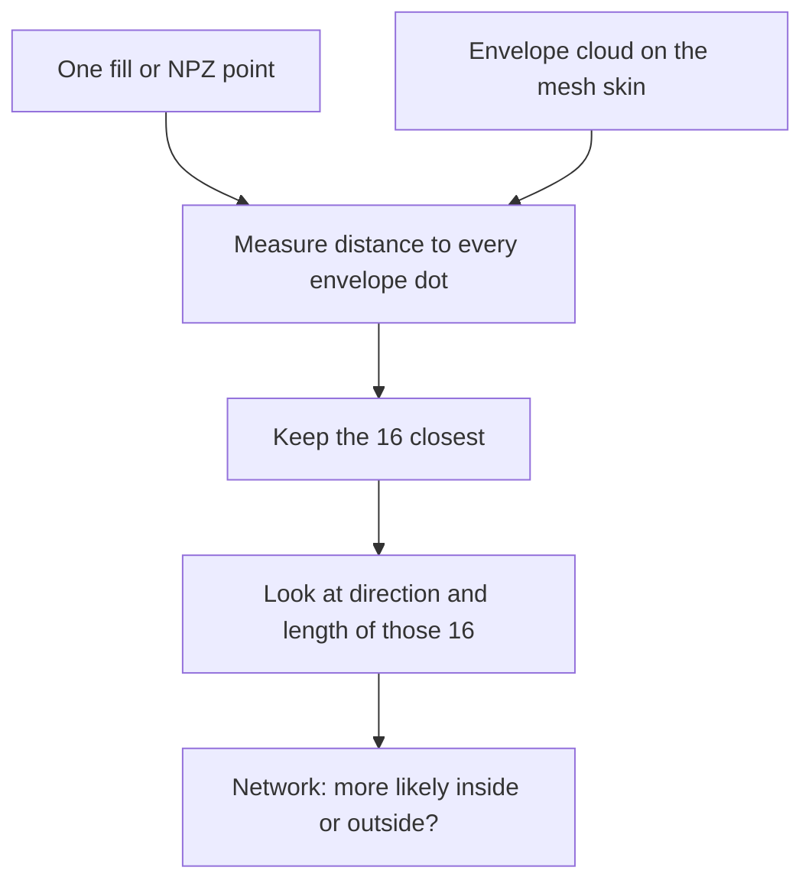

# Phase 3 — work plan

Now that we've established the second phase—a pipeline that trains on many occupancy files and looks at the whole outer skin of a shape as one summary—we can move on to the third phase:
teaching the network to look at *nearby* skin, so Fill is not only a score on the catalog average.
Phase 2 helped on simple extrudes, but thin arms stayed empty. More dots on sharp edges, and a wider network, did not fix that: every fill point still saw the same whole-shape summary. There was nothing left to squeeze out of that approach.

Here, we build the path step by step: from each fill point looking at the **16 nearest envelope dots**, through a mixed catalog of primitives and extrudes (holes empty, boxes eaten), then a denser envelope if arms are still empty, then directions on the skin (**normals**), then a bank of **rounded extrudes** (same limbs, no sharp corners), then animals and humans if we still need them.

The idea is mainly to add one more layer of complexity at a time—local envelope neighbors, then a mixed catalog, then a denser skin, then normals, 
and so on—and to look at each layer before deciding whether we even need the next.
We might get good enough results without moving on. Some layers may not help at all; some may even make things worse.

Empty sleeves, or a window that should be a hole, still mean the layer failed, even if the average score looks better.

---

## How to read this plan

Work proceeds **one step at a time**. After each step we stop for review. Catalog trains get a write-up in [`training_log.md`](training_log.md), not in `CHANGELOG.md`. Changelog is code and knobs only.

Progress is visible in:

- this file
- [`CHANGELOG.md`](../CHANGELOG.md) (what shipped: code and knobs — not train scores)
- [`training_log.md`](training_log.md) (each training: catalog, wall time, conclusions)
- `runs/` (config snapshot + `metrics.jsonl` + TensorBoard)
- `models/<run_id>/` (weights; `best.pt`)
- the occupancy **viewer** (Fill is the success bar for sleeves and holes)

---

## The twelve steps at a glance

| Step | Theme | What we learn |
|---|---|---|
| 1 | Local neighbors (the idea) | Empty sleeves were a *reading* problem, not “need more crease dots” |
| 2 | k-NN inside `OccupancyEncoder` | Each query can keep 16 envelope offsets without a new sampler |
| 3 | Knob, checkpoint, infer, viewer | `knn_k` on `best.pt`; old global heads still load (`knn_k` missing = 0) |
| 4 | First k-NN catalog (`nr1` only) | Fill on simple extrudes: orange in the arms |
| 5 | Mixed catalog infrastructure | Several globs + a mesh cap so 2500 `nr1` files do not drown torus/pipe |
| 6 | Mixed primitives + capped extrude train | One head can eat boxes **and** leave holes empty (viewer Fill) |
| 7 | Denser envelope | Does `n_surface: 2048` fill thin `nr4`/`nr5` arms? |
| 8 | High-round extrudes in the mix | All `nr4` / `nr5` we have, still balanced vs primitives |
| 9 | Envelope normals | Face `n` on each skin dot — leaks between towers, thin windows |
| 10 | Rounded extrudes (Maya) | Same extrude limbs, then smooth — a generated organic-like bank |
| 11 | Train on that rounded bank | Fill on rounded chimneys / blobs, not on 20 varied animals |
| 12 | Locked holdout | A family that never selected `best.pt` (Phase 2 Step 11, still open) |

---

## Step 1 — Name the empty-sleeve failure

The global envelope max-pool gives every query the **same** shape vector. A point in a sleeve and a point in empty air share that vector. The head then uses “where in the bounding box?” and learns that far from the center is usually empty.

**Proposed reading (same 1024 purple dots):** keep that whole-shape summary, **and** for each fill / NPZ point look at the **16** nearest envelope dots. Envelope sampling is unchanged (mix 75 still only moves *where* the dots sit). Only **how each query reads** that cloud changes.

| Question | Answer |
|---|---|
| Does each fill point look for nearby envelope dots? | **Yes.** |
| How is “near” measured? | Straight-line distance in 3D, after fill and envelope share the **same** AABB frame. |
| Whole envelope or a region? | Distance to **all** `n_surface` dots, then keep the **16** smallest. |
| Is one closest dot enough? | **No.** One distance only says “how far is the skin?” Sixteen dots show whether the skin **surrounds** the point or sits in **one direction**. |
| Neighbor count? | **`knn_k = 16`**. Not 1. |
| Neighboring fill labels? | **No.** Only envelope xyz. NPZ labels stay the training answer. |

Short arrows in several directions → likely inside a tube. Long arrows all one way → likely air.

**Done when:** this idea is written down and agreed. No `src/` change required for the spec itself. Former home: `docs/local_knn_envelope_occupancy.md`.

---

## Step 2 — Local k-NN in the occupancy head

Keep the global PointNet summary. Add a small pool over the 16 offsets `p − q` (envelope minus query). Head is `cat(xyz, z_global, z_local)`. `knn_k = 0` is the old global-only head. `knn_k > 0` is surface-only (not the mesh-token head).

Do **not** use neighboring NPZ labels. Envelope sampling is unchanged.

**Done when:** unit tests cover offsets, `knn_k=0` vs `>0`, and mesh+knn is rejected. `knn_offsets` + `OccupancyEncoder` in `src/occupancy_encoder.py`.

---

## Step 3 — YAML, checkpoint, infer, viewer

`knn_k` (and optional `knn_local_dim`) in YAML. Store both on `best.pt`. Missing `knn_k` loads as 0 so mix-75 global checkpoints still infer. Viewer **Run model** rebuilds the envelope from the **checkpoint** mix and count, then runs the same k-NN. Overlay Mix/Count stay display-only.

Old mix-75 weights **cannot** load into a `knn_k=16` first Linear. New train required.

**Done when:** config tests, train/infer wiring, and viewer via `load_occupancy_model` are green.

---

## Step 4 — First catalog train: `extrude_*_nr1`, k=16, mix 75

Fresh train (not a resume of the global mix-75 head). Success is **Fill sleeves**, not a 0.01 IoU bump. Empty arms with a higher average IoU still means the increment failed.

**Done when:** a `runs/<id>/` exists, `best.pt` is stored, the training log has an entry, and Fill on simple `nr1` extrudes shows orange in the arms. Champion numbers on `nr1`: `2026-09-02_11-18-13_extrude_nr1_surface_knn16` (best @ 19, val IoU ~0.974 on that **nr1-only** val). Write-up belongs in [`training_log.md`](training_log.md).

---

## Step 5 — Catalog union and a mesh cap

One YAML glob cannot say “all primitives plus 700 `nr1` meshes.” `npz_catalog` unions globs. Optional `max_shapes` keeps that many unique meshes per glob (sampled with `seed`). Combo filenames stay excluded. Varied one-off stems (`Cone.obj`) must not ride a Windows case-insensitive glob.

**Done when:** tests cover union, cap, and stray `Cone__` exclusion. Live YAML can list primitives + capped extrudes.

---

## Step 6 — Mixed primitives + capped extrude train

Fresh `knn_k=16`, mix 75, all primitive families (including torus/pipe holes) plus 700 `nr1`, 100 `nr3`, 80 `nr4` (no `nr2` NPZs on disk). About 3526 files / 1763 meshes.

Success is **viewer Fill**: torus/pipe **holes empty**, simple extrudes still eaten. Val IoU is **not** comparable to the `nr1`-only 0.974.

**Done when:** `runs/` + `best.pt` + training log, and Fill on holes/simple CAD looks right. Run `2026-09-02_15-25-10_prim_extrude_knn16` (best @ 20, val IoU ~0.954 on the **mixed** val). Inspect default for holes and simple CAD. High-round extrudes (`nr4`/`nr5`) and organic Fill still fail on this checkpoint — that is what later steps are for, if we need them. Do not throw this checkpoint away.

---

## Step 7 — Denser envelope (`n_surface: 2048`)

A 5-round extrude still gets **1024** skin dots, same as a cube. k-NN in a thin arm then often sees the **core**. Same head (`knn_k=16`, mix 75), **same mixed catalog**, fresh train. One YAML knob. Overlay Count still does not change infer.

**Done when:** a catalog train exists and Fill on `nr4`/`nr5` arms is compared to Step 6. If arms stay empty, do not call it a win.

---

## Step 8 — More high-round extrudes, still balanced

Use all `nr4` we have; add `nr5` if NPZs exist. Keep primitive count in the same ballpark so holes are not drowned. Do not dump thousands of near-duplicate cones instead.

**Done when:** Fill on high-round extrudes is re-checked vs Step 7. Catalog still excludes `combo*` and varied organics.

---

## Step 9 — Face normals on envelope dots

Each skin dart carries the **outward** normal of the face it sits on (crease darts need a written rule: source face or average of the two). Local features can use offsets and `(p − q) · n`. New first Linear: **cannot** resume Step 6/7 weights.

This is for **leaks between towers** and thin windows, not a substitute for a starved envelope on a many-limb mesh.

**Done when:** tokens are 6D (or equivalent), tests exist, a catalog train is logged, and Fill on a leaky `nr4` gap is compared.

---

## Step 10 — Rounded extrudes (Maya)

We do not have a large animal/human mesh bank. We already have a Maya batch that builds cubes, extrudes faces, closes the solid, and writes OBJs (`maya_batch_extrude.py`: polyCube → `polyExtrudeFacet` rounds → `_finalize_solid` → OBJ). The next generation step is the same pipeline plus a **smooth** after the extrudes, so chimneys and limbs stay, but corners round off.

That is not a giraffe. It is a family-sized set of **organic-like CAD**: protrusions without creases. Mix 75 (dots on sharp edges) is the wrong prior for these meshes; envelope mix should sit nearer face-area.

Keep this out of the existing `Extrude/` folder and `extrude_*` filenames, or the CAD catalog globs will swallow them. New script (or a clearly separate `run_smoothed(...)`), new export folder, then the existing conda `dataset_builder.py` for NPZs. Smooth after `_finalize_solid`. If the smooth is too strong on a thin arm, two limbs can fuse — keep thickness and smooth amount in a range that still looks like separate chimneys.

**Done when:** Maya writes a distinct OBJ family; occupancy NPZs exist; they do not match `extrude_*.npz`.

---

## Step 11 — Train on the rounded bank

A dedicated catalog of the Step 10 meshes (order of a primitive family, not 20 files from `meshes/varied/`). Do **not** sprinkle Human2 into the CAD glob as a 1% regularizer. Prefer mix nearer 0. Judge Fill on rounded limbs and blobs, not on CAD val IoU. A real animal/human dump, if we ever get one, is still a later set — this step does not wait for it.

**Done when:** a catalog train exists and Fill is judged on the rounded family.

---

## Step 12 — Locked holdout

Catalog val already holds out unique OBJs to pick `best.pt`. This step is a mesh or family that **never** selected the checkpoint. Same question as Phase 2 Step 11, now with the Phase 3 head.

**Done when:** we can say whether local k-NN (and later normals) beat a control on a never-trained identity. Do not start this as “add a train/val split.”

---

## What we are not doing in these twelve steps

Voxel grids, FFT / scattering filters, and Kymatio stay out. Combo scenes (`combo*`) stay out until a later plan. Helix-flood mixes as the default catalog stay out. Turning **Inside cut** down to paint sleeves is not a model fix. Using other fill points’ labels as input is cheating. Face-triangle neighbors instead of envelope dots wait until envelope k-NN is finished being measured. Wider/deeper MLP (`hidden` / `depth`) is not a Phase 3 rung — it already lost an A/B on simpler data.

Phase 3 is still not a finished CAD+organic product. High-round extrudes, thin windows, and rounded / animal shapes remain hard until we take those layers.

---

## How to follow progress

| You want… | Look at… |
|---|---|
| The current step | this file |
| What actually shipped | [`CHANGELOG.md`](../CHANGELOG.md) |
| What a train meant | [`training_log.md`](training_log.md) |
| Curves and JSON | `runs/<id>/` |
| Weights to load | `models/<id>/best.pt` |
| Phase 1 | [`work_plan_phase1.md`](work_plan_phase1.md) |
| Phase 2 | [`work_plan_phase2.md`](work_plan_phase2.md) |

---