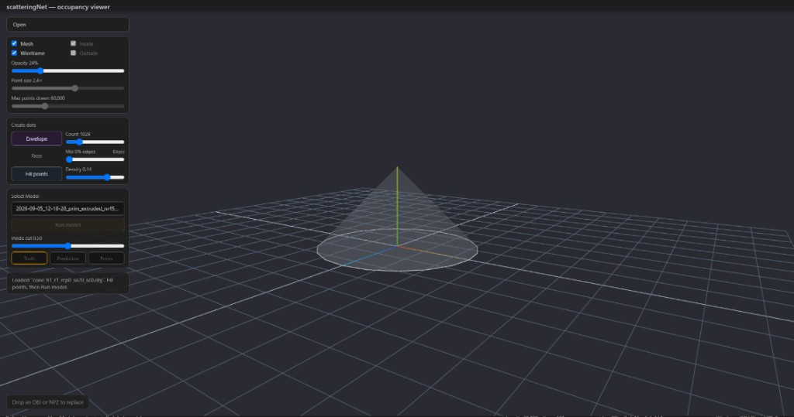
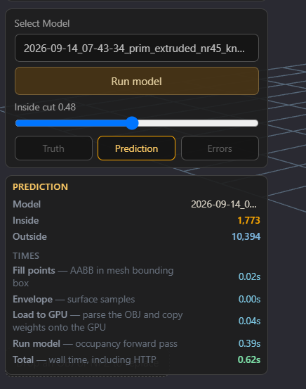
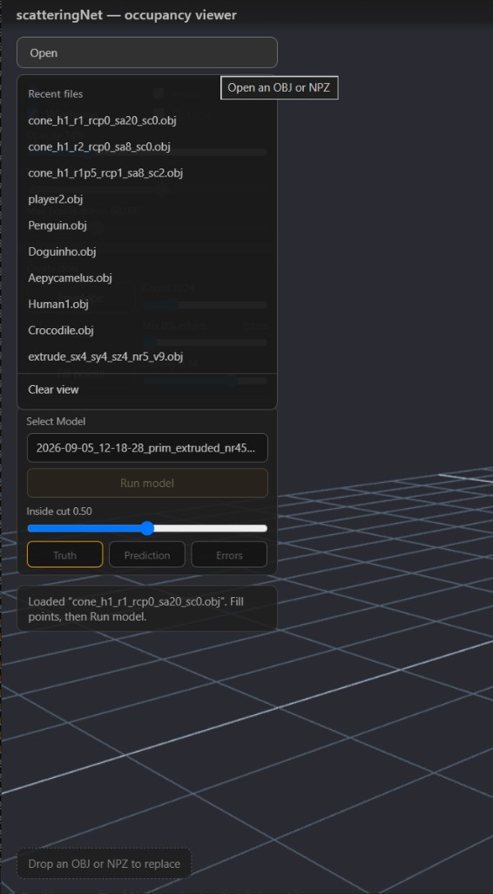
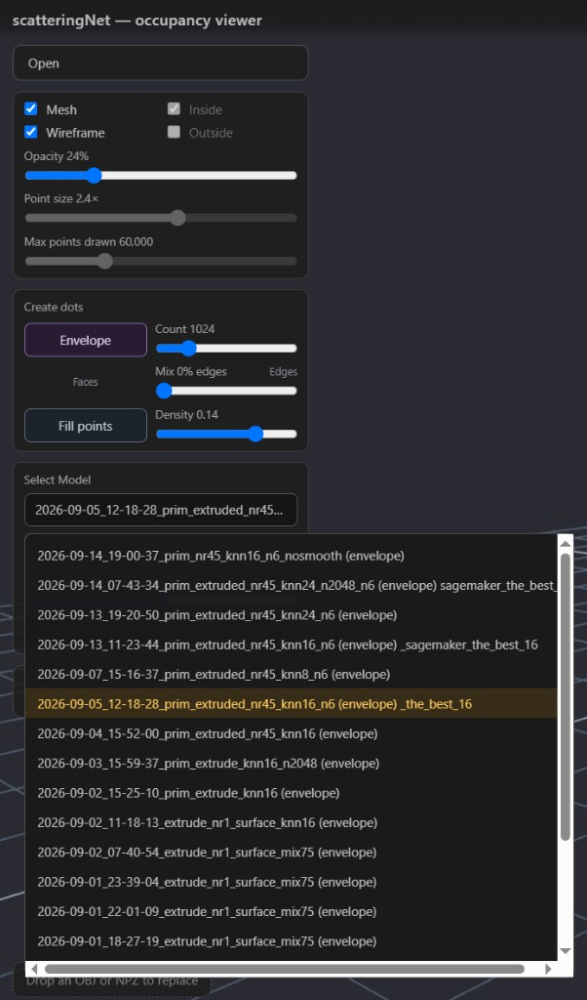

# Occupancy viewer

Inspect trained occupancy models in the browser. This folder is the viewer only; occupancy train/infer modules under `src/*.py` are not modified.

The page is Three.js. A localhost helper (`serve.py`) lists `models/<run_id>/best.pt`, fetches OBJ files under `config.yaml` `data_dir`, fills an unlabeled AABB lattice, and runs inference (needs conda env **scatteringNet** with PyTorch). The inspect color in this page is display only. The model labels points; another host (for example a Maya plugin) can draw those labels however it wants.

Gradio is a separate Job B UI (`src/gradio`, `open_gradio.bat`). Do not merge the two. Both default to the **INSPECT** alias in [`docs/inspect_checkpoint.yaml`](../../docs/inspect_checkpoint.yaml). Use `open_viewer.bat` for this page.

## How to open

**Double-click** `open_viewer.bat` (repo root or this folder). Close any old black console first, or the browser may still talk to a Python that has no `torch`. Keep the new console open: it **warms** CUDA / torch, a tiny fill, and one dummy infer on the **INSPECT** `best.pt` (else newest) **before** the browser opens (often ~8 s), so the first **Run model** is not the cold start. If the console already printed `warmup: done` but the page stays on “3D script never started”, close that tab and the console, then run the bat again (stale `text/plain` on a `.js` module).

Put checkpoints at `models/<run_id>/best.pt`. The Model list is that folder. With no saved `model_id` in `ui_prefs.json`, the list selects the INSPECT pointer. `09-16` and `pos_weight` stay in the list as A/B logs.

## The page



The 3D view is the right-hand pane: a dark floor grid, RGB world axes, and the loaded mesh. Drag to orbit. This still is an OBJ after **Open** (a cone, mesh + wireframe, 24% opacity). **Inside** / **Outside** are greyed until there is a lattice — one click on **Run model** builds that fill and classifies it, or click **Fill points** first to preview the unlabeled grid. You can also drop an OBJ or NPZ onto the view (hint at the bottom).

The left column is the whole UI. Top to bottom:

| Control | What it does |
|---|---|
| **Open** | File picker, or hover for recents (see below). |
| **Mesh** / **Wireframe** | Show the OBJ. Opacity is mesh only. |
| **Inside** / **Outside** | Show classified query points after Fill / Run. Off until there is a cloud. |
| **Point size** / **Max points drawn** | Display only. Infer and Fill still use every query; the draw cap is a subsample. Point size also scales envelope dots. |
| **Envelope** | Purple overlay of area-weighted skin samples. **Count** is how many (256–4096, default 1024). Overlay Count does **not** change infer. |
| **Fill points** + **Density** | Unlabeled AABB lattice (OBJ). Optional preview only — **Run model** fills on its own. Dragging density refills; the camera does not reset. Fill turns Inside and Outside on so the lattice is visible. |
| **Clear points** | Remove fill and envelope points. The mesh stays (unlike **Clear view**). |
| **Select Model** | Checkpoints under `models/` (see below). |
| **Run model** | One click. On an OBJ: fill at the current **Density**, rebuild the infer envelope, then classify. On an NPZ: classify the file points. Disabled until an NPZ is loaded, or an OBJ is open with a model selected. |
| **Inside cut** | After a Run, inside if sigmoid *p* ≥ this value (default 0.50). Lower counts more points as inside. Dragging re-cuts the last Run in the browser (no extra GPU pass). Status acc/IoU follow this cut; training metrics stay at 0.5. |
| **Truth** / **Prediction** / **Errors** | NPZ views. On an OBJ they stay idle (no file labels). |

## After Run model



The **PREDICTION** block under the view buttons. **Model** is the checkpoint. **Inside** / **Outside** follow the **Inside cut** slider (no extra GPU pass). **Times**:

| Row | Meaning |
|---|---|
| **Fill points** | AABB lattice in the mesh bounding box |
| **Envelope** | Surface samples for the encoder |
| **Load to GPU** | Parse the OBJ and copy weights onto the GPU |
| **Run model** | Occupancy forward pass |
| **Total** | Wall time, including HTTP |

## Open / recents



- Click **Open** for a picker, or drop an `.obj` / `.npz` on the page.
- Hover **Open** for the last **ten** files (names in `localStorage`; bytes in IndexedDB). **Open an OBJ or NPZ** is the same picker.
- **Clear view** is at the bottom of that recents menu.
- An NPZ with `mesh_path` auto-fetches that OBJ from `data_dir` (`GET /api/mesh`). Paths stay under `data_dir`; checkpoints stay under `models/`.

## Select Model



This is a custom list (a native `<select>` cannot take a right-click). Each row is `models/<run_id>/best.pt`. Envelope heads are tagged `(envelope)`. Face-token occupancy checkpoints are no longer loaded.

Right-click a row to type a suffix (`*` or a short note) after the existing label — in the still, `_the_best_16` and `sagemaker_the_best`. Stored in `ui_prefs.json` as `model_labels`. Folder names under `models/` are not renamed.

## Job A (NPZ)

Infer on the file’s `points` (the box is not resampled). **Truth** = file labels. **Run model** then **Prediction** / **Errors** (missed inside vs false inside). Envelope checkpoints rebuild the surface cloud from the NPZ `mesh_path` OBJ.

## Job B (OBJ)

Typical inspect path: **Open** an OBJ → pick a model → **Run model** (one click fills at the current **Density**, then classifies). **Fill points** is optional if you want to preview the unlabeled lattice first.

**Create dots** has two rows:

1. **Envelope** — overlay only. Area-weighted face samples, same sampler as train/infer. Overlay **Count** does not change infer.
2. **Fill points** + **Density** — unlabeled AABB lattice. OBJ-only. Envelope also works when an NPZ has loaded its OBJ.

Then **Run model** (fills first if you skipped **Fill points**). Envelope checkpoints rebuild the surface cloud from the **uploaded** OBJ. No **Errors** view (no file labels). Until you run, a Fill-only lattice is unlabeled and shows as outside.

Density slider 0–100 maps to lattice **spacing** (pad = spacing):

| Slider | Spacing | Meaning |
|---|---|---|
| 0 | 0.40 | coarse |
| 71 (default) | ≈ 0.15 | training occupancy default |
| 100 | 0.05 | dense |

Right = denser (smaller step). The helper caps the lattice at **200,000** points and coarsens spacing if needed.

## UI prefs

Checkboxes, sliders, density, **Envelope count**, **Inside cut**, the selected model, and optional **model list notes** are saved to `src/viewer/ui_prefs.json` (helper `GET`/`POST /api/ui-prefs`). Missing file uses defaults; see `ui_prefs.example.json`. Gitignored. Truth / Prediction / Errors are not saved (they depend on the loaded file).

## Tests

From the repo root, conda env **scatteringNet**:

```text
python tests/test_viewer_server.py
```

Do not use `python -m unittest tests.test_viewer_server` (`tests` is not a package).

## Layout

```text
src/viewer/
  serve.py           localhost static + API
  mesh_access.py     OBJ path under data_dir
  model_access.py    models/<run>/best.pt
  infer_job.py       Job A / Job B forward
  envelope_job.py    area-weighted surface samples for the Envelope overlay
  obj_fill.py        unlabeled AABB lattice
  ui_prefs.py        ui_prefs.json
  js/                page modules (not occupancy Python)
  vendor/            Three.js
```
